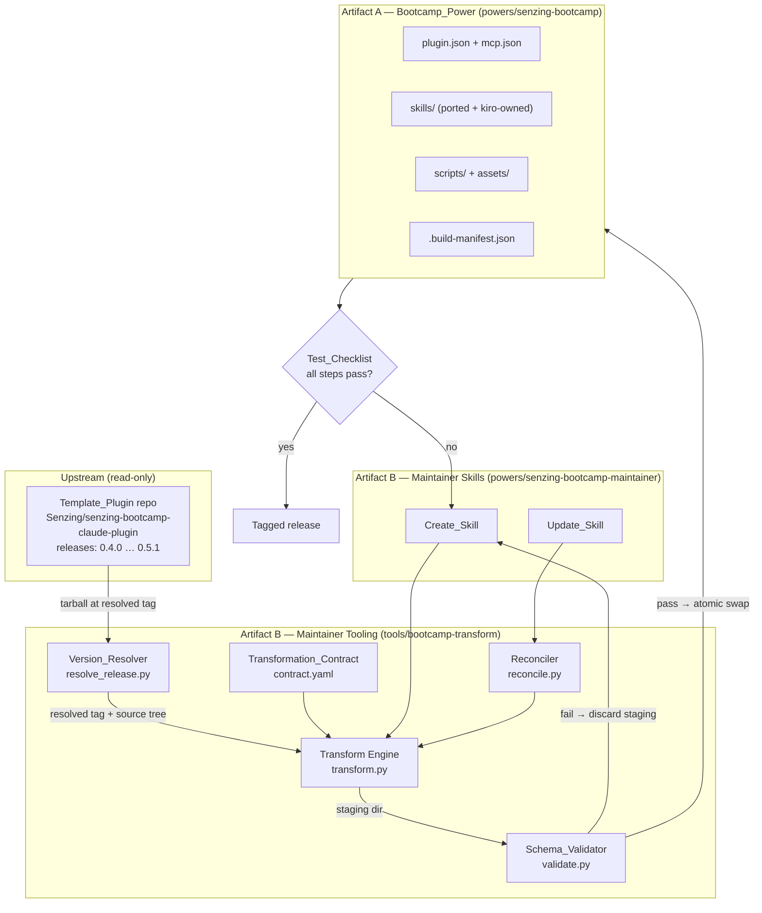

# Design Document

## Overview

This design delivers two artifacts in one greenfield repository:

- **Artifact A — `Bootcamp_Power`**: an installable Kiro Power at `powers/senzing-bootcamp/`, packaged in Agent Plugins v1.0.0 format, that reproduces the Senzing Bootcamp learning experience for Bootcampers on Linux, macOS, and Windows. *(R4, R7, R8, R9, R10, R11, R12, R14, R16)*
- **Artifact B — Maintainer tooling**: a deterministic, executable transformation pipeline plus two maintainer skills that create the Bootcamp_Power from a `Template_Release` and propagate later releases into it. *(R1, R2, R3, R5, R6, R13, R14, R15)*

The central design decision is that the **`Transformation_Contract` is a machine-readable manifest executed by a shared transform engine, not prose instructions interpreted by an agent.** Requirement 3 AC5 demands byte-for-byte identical output from the create and update paths given identical input. An agent following prose cannot guarantee byte-for-byte reproducibility across two invocations; a data-driven engine can. Every other component in Artifact B is organized around that engine: the `Version_Resolver` feeds it, the `Schema_Validator` gates it, and `Create_Skill` / `Update_Skill` are thin orchestrators over it.

### Research summary: verified facts driving this design

The following were confirmed against the upstream repository and the Agent Plugins / Kiro documentation and are treated as ground truth.

| Fact | Detail | Design consequence |
|---|---|---|
| Template release tags | `0.4.0`, `0.4.1`, `0.5.0`, `0.5.1` (latest). Bare semver, **no `v` prefix**. | `Version_Resolver` parses bare semver; no prefix stripping. *(R1)* |
| Template is a marketplace repo | `.claude-plugin/marketplace.json` at root; the plugin lives in the **subdirectory** `plugins/senzing-bootcamp/`. | Contract source paths are rooted at `plugins/senzing-bootcamp/`, not the repo root. *(R3)* |
| Skill inventory | **12** skill directories, of which **9** are modules: `00`, `01`, `02`, `03`, `03b`, `04`, `05`, `06`, `07`. | Contradicted the original R7 AC1 (see Requirements Defects); the inventory is now derived per R7 AC1/AC2. *(R7)* |
| Skills are long and densely cross-referenced | Relative links such as `../bootcamp-onboarding/ground-rules.md`, `../module-02-sdk-setup/SKILL.md`. | Preserve `skills/<name>/` layout verbatim so links resolve unchanged. *(R8)* |
| Content is invariant-governed | Hundreds of inline `INV-NNN` references. | Port prose essentially verbatim; never rewrite for style. *(R7 AC15)* |
| Template skill frontmatter | Only `name` and `description`. | Agent Plugins frontmatter adaptation is **additive** (`license`, `metadata`) — low risk. *(R8 AC5)* |
| Template `.mcp.json` | `{"mcpServers":{"senzing":{"type":"http","url":"https://mcp.senzing.com/mcp"}}}` | Translate `http` → `streamable-http`, add `$schema`. *(R11)* |
| Template scripts | ~18 Python files, `scripts/vendor/d3.v7.min.js`, `senzing_logo_light.png`. | Vendored assets copied byte-for-byte. *(R10 AC3)* |
| Hook scripts import each other | `import recap_checkpoint`, `import docker_lifecycle` — same-directory module imports. | **Scripts must stay co-located in one directory.** *(R10 AC1 interpretation)* |
| Claude-specific strings present | `${CLAUDE_PLUGIN_ROOT}`, "Claude Code", "Claude Desktop", "Claude Max plan", "Sonnet 5", `.claude-plugin/plugin.json` path in `feedback-capture.py`, tool names `Write|Edit`. | Named substitution sets in the contract. *(R10 AC2, R12 AC2)* |
| Agent Plugins `plugin.json` | Fixed top-level field set; custom data belongs under `extensions` keyed by reverse domain. | Template-release provenance goes in `extensions`, not a bare field. *(R2 AC5)* |
| Kiro hook triggers | `SessionStart`, `UserPromptSubmit`, `PreToolUse`, `PostToolUse`, `PreTaskExec`, `PostTaskExec`, `PostFileSave`, `PostFileCreate`, `PostFileDelete`, `Stop`. | No `PreCompact`, no `SessionEnd`. *(R7 AC4–AC14)* |
| Kiro blocking semantics | Exit 2 blocks for `PreToolUse`, `UserPromptSubmit`, `PreTaskExec` only — **not** `Stop`. | `stop-nudge.py` loses its blocking power. Partial-parity gap. |
| Kiro hook file format | `{"version":"v1","hooks":[{name,trigger,matcher?,action}]}`; `command` action takes a **single command string** (no `args` array). | The interpreter path and the script path are each resolved to a **quoted absolute path at install time**, so no shell is needed to locate either — preserving `INV-052`'s no-shell-dependency guarantee without an `args` array. *(R16 AC3, AC4, R10 AC5)* |
| Template hooks are shell-free by invariant | Template_Invariant **`INV-052`** requires every hook to be a Python 3 script invoked in Claude exec form (`command: "python3"` + script path in `args`) so hook execution "has no shell dependency on Linux, macOS, or Windows"; every template hook script header repeats it. Supporting: **INV-001** (all three platforms), **INV-166**/**INV-167** (PowerShell 5.1 parser and encoding hazards), **INV-168** (Windows does not put executables on PATH). | `INV-052` is a portability guarantee, not a Claude packaging quirk. It is **honored, not discounted** *(R15 AC3, AC6)*, and drives the Cross-Platform Strategy below. |
| `python3` is not reliably on PATH | On Windows the executable is normally `python` or the `py` launcher; a bare `python3` frequently resolves to nothing, or to a **Microsoft Store App Execution Alias stub** that opens the Store instead of running the script. | No generated command may name a bare interpreter — the interpreter is always an absolute path resolved at install time. *(R16 AC2)* |
| Agent Plugins extension dirs | Clients ignore extension namespaces they do not implement, **without validating them**. | `dev.kiro/hooks/` is harmless but cannot be relied on. |

### Unverified assumptions

These are called out explicitly because the design must remain correct if they turn out false. Each has a corresponding empirical check in the `Test_Checklist`, now mandated by a specific acceptance criterion *(R6 AC7–AC11)*.

| ID | Assumption | Verified by | If false |
|---|---|---|---|
| **A1** | Kiro auto-loads hook definitions bundled in a Power under `dev.kiro/hooks/`. **Believed FALSE today** — the Agent Plugins spec lists no hooks component, Kiro's hooks are workspace files at `.kiro/hooks/*.json`, and Kiro's documented plugin-install payload lists skills, steering, scripts, and assets but not hooks. | **R6 AC7** — observe whether a hook bundled under `dev.kiro/hooks/` fires in an installed Power, and record the outcome | Tier 2 (consented workspace install) carries enforcement. Design already assumes this. |
| **A2** | `${PLUGIN_ROOT}` expands inside a Kiro hook `command` string. The Agent Plugins spec guarantees expansion only for `mcp.json` stdio `args`/`env`/`cwd`. | **R6 AC8** — verify each hook written into the `Workspace_Hooks_Directory` fires on its declared trigger, which fails if the command path does not resolve | The hook installer resolves and writes an **absolute** script path at install time. Design already assumes this. |
| **A3** | Kiro's write-tool names match the regex `fs_write\|str_replace\|fs_append` for a `PreToolUse` matcher. | **R6 AC11** — verify the shipped `PreToolUse` matcher pattern matches the tool names Kiro reports for its file-write tools | Matcher regex is a single contract value; correct it in one place and rebuild. |
| **A4** | A Power's `skills/*/scripts/` files are materialized on disk at a stable absolute path after install. | **R6 AC8** — the same trigger-firing check, since a hook whose absolute script path is not stable fails to fire | The hook installer copies the script set into the workspace alongside the hook JSON instead of referencing the Power path. |

Two further checklist criteria cover the installer's own contract rather than an assumption: **R6 AC9** requires running the `Hook_Installer` twice and confirming the second run leaves the `Workspace_Hooks_Directory` identical (idempotence, *R7 AC8*), and **R6 AC10** requires following the documented removal procedure and confirming it deletes exactly the files the installer created, leaving every other workspace hook file untouched (*R7 AC10*).

---

## Requirements Defects (Resolved)

Research contradicted several acceptance criteria. Each defect below was reported against `requirements.md`, and `requirements.md` has since been amended to adopt every recommended restatement — so design and requirements are now aligned. The analysis is retained because it is the rationale for the amended criteria: it records *why* each criterion reads the way it now does, and what breaks if a future release reverts it.

### D1 — R7 AC1 skill and module counts were factually wrong (blocking)

The original R7 AC1 asserted "the eight modules numbered 00 through 07 ... for a total of 11 skills."

Verified reality at release `0.5.1`: **nine** module skills (`00`, `01`, `02`, `03`, **`03b`**, `04`, `05`, `06`, `07`) and **twelve** skills total (9 modules + `bootcamp-onboarding` + `bootcamp-preparation` + `graduation`).

Beyond the arithmetic, hardcoding a count is brittle: any upstream release that adds or removes a module silently invalidates the requirement and would fail a conformance check that is testing the wrong thing.

**Recommended restatement:** *"THE Bootcamp_Power SHALL provide exactly one skill for each bootcamp skill directory present in the resolved Template_Release, and SHALL provide no ported bootcamp skill that has no corresponding Template_Release skill directory."* The inventory becomes **derived** from the resolved release, and the property that matters — a bijection between template skill directories and ported skills — becomes testable across every release. *(Implemented as Property 16.)*

**Status: Resolved** — R7 AC1 now states the inventory-derived one-skill-per-template-directory rule with no hardcoded counts, and the exclusivity half moved to R7 AC2.

### D2 — R7's hybrid hook assumption was superseded

The original R7 AC3 required reimplementing hook behavior "as a Kiro hook under the `dev.kiro/hooks/` directory" wherever a clean Kiro trigger equivalent exists. Per **A1**, a bundled `dev.kiro/hooks/` directory is almost certainly not loaded by Kiro today, so satisfying that literally would produce hooks that never run — worse than no hooks, because enforcement would appear present but be absent.

**Recommended restatement:** replace the old AC3/AC4 with the three-tier strategy in [Hook Parity Strategy](#hook-parity-strategy) — behavior always expressed in skill instructions (Tier 1), enforcement optionally installed into the Bootcamper's workspace `.kiro/hooks/` with consent (Tier 2), and definitions additionally shipped under `dev.kiro/hooks/` for forward compatibility (Tier 3).

**Status: Resolved** — the old R7 AC3/AC4 were replaced by R7 AC4–AC14, which encode the three-tier strategy: AC4 (Tier 1 baseline), AC5–AC11 (Tier 2 consented install, disclosure-before-write, idempotence, `senzing-bootcamp-` prefix, documented removal, decline-leaves-Tier-1), AC12 (Tier 3 forward compatibility, never a sole delivery path), and AC13–AC14 (documented partial-parity gaps).

### D3 — R2 AC5 provenance field must live under `extensions`

R2 AC5 originally required recording the resolved Template_Release version "in the Bootcamp_Power `plugin.json` metadata." The Agent Plugins v1.0.0 plugin schema defines a fixed top-level field set; a bare custom field like `templateRelease` would be reported and ignored. Provenance therefore goes under `extensions["com.senzing.bootcamp"].templateRelease`. AC5 needed to name that location so R13 schema validation and R2 AC5 could not conflict.

**Status: Resolved** — R2 AC5 now requires the provenance under `plugin.json` → `extensions` → `com.senzing.bootcamp` → `templateRelease`, explicitly outside the fixed top-level field set.

### D4 — R10 AC1 per-skill script location collided with Python module imports

R10 AC1 originally required every ported script under `skills/<skill-name>/scripts/`. The hook scripts import one another as same-directory Python modules (`import recap_checkpoint`, `import docker_lifecycle`). Distributing them across per-skill directories breaks those imports at runtime.

**Design interpretation (satisfies AC1 literally):** all ported scripts live under **one** owning skill — `skills/bootcamp-onboarding/scripts/` — which is a valid `skills/<skill-name>/scripts/` path. `bootcamp-onboarding` owns them because it is the entry point and the owner of session lifecycle and ground rules. Other skills reference them by relative path (`../bootcamp-onboarding/scripts/<x>.py`). AC1 needed to say "under a single owning skill's `scripts/` directory" to make the intent explicit.

**Status: Resolved** — R10 AC1 now requires all ported scripts together under a single owning skill's `scripts/` directory so same-directory Python module imports resolve, and new R10 AC6 requires the Schema_Validator to report a broken same-directory module import and block tagging.

### D5 — R7 AC1 "no skill without a template counterpart" conflicted with R9 AC1 and Tier 2 hooks

The original R7 AC1's exclusivity clause forbade any bootcamp skill lacking a Template_Release skill. But R9 AC1 mandates three **command-derived** skills (whose counterparts are template *commands*, not skills), and Tier 2 requires a hook-installer skill (counterpart: template *hooks*).

**Recommended restatement:** scope the exclusivity clause to *ported bootcamp module/flow skills*, and state that command-derived skills and client-adaptation skills are governed by R9 and the hook-parity criteria respectively.

**Status: Resolved** — R7 AC2 now carries the exclusivity clause with a WHERE clause deferring command-derived skills to R9 and client-adaptation skills to the R7 hook-parity criteria (AC4–AC14).

### D6 — `Stop` blocking parity is unachievable

`stop-nudge.py` is a **blocking** Claude `Stop` hook. Kiro has a `Stop` trigger but documents blocking (exit 2) only for `PreToolUse`, `UserPromptSubmit`, and `PreTaskExec`. The closing-👉-question rule can therefore only be *advised*, not *enforced*. This is a permanent, documented parity gap, not a defect to fix. R7's parity language needed to acknowledge partial parity where the host lacks the mechanism.

**Status: Accepted as a documented parity gap** — R7 AC14 now states it explicitly: where Kiro provides a trigger equivalent that cannot block (Kiro `Stop`), the blocking behavior becomes an advisory instruction in the owning skill and the gap is documented. R7 AC13 does the same for the triggers Kiro lacks entirely (Claude `PreCompact`, `SessionEnd`).

---

## Architecture

### Repository layout

```
senzing-bootcamp-kiro-power-development/
├── .gitattributes                           # LF normalization on every platform (R16 AC8)
├── LICENSE                                  # Apache-2.0 (R14 AC3)
├── README.md
├── powers/
│   ├── senzing-bootcamp/                    # ARTIFACT A — the deliverable (R14 AC1)
│   │   ├── plugin.json                      # generated (R4 AC2, R2)
│   │   ├── mcp.json                         # generated (R4 AC3, R11)
│   │   ├── LICENSE                          # Apache-2.0 (R4 AC4, R14 AC3)
│   │   ├── CHANGELOG.md                     # update entries (R5 AC8)
│   │   ├── .build-manifest.json             # provenance + hashes (update reconciliation)
│   │   ├── skills/
│   │   │   ├── bootcamp-onboarding/         # ported, OWNS scripts/ (D4)
│   │   │   │   ├── SKILL.md
│   │   │   │   ├── references/              # feedback.md, ground-rules.md, ...
│   │   │   │   ├── scripts/                 # ALL ~18 ported .py + vendor/ (R10)
│   │   │   │   └── assets/kiro-hooks/       # Tier 2 hook definitions
│   │   │   ├── bootcamp-preparation/
│   │   │   ├── module-00-…  …  module-07-…  # 9 module skills
│   │   │   ├── graduation/
│   │   │   ├── start-bootcamp/              # command-derived (R9)
│   │   │   ├── graduate-bootcamp/           # command-derived (R9)
│   │   │   ├── bootcamp-feedback/           # command-derived (R9)
│   │   │   └── bootcamp-enforcement-setup/  # Tier 2 installer skill
│   │   ├── docs/                            # ported docs + examples (R12 AC1)
│   │   └── dev.kiro/hooks/                  # Tier 3 forward-compat (harmless if ignored)
│   └── senzing-bootcamp-maintainer/         # ARTIFACT B — maintainer skills (R14 AC2)
│       ├── plugin.json
│       └── skills/
│           ├── create-bootcamp-power/SKILL.md   # Create_Skill (R4)
│           └── update-bootcamp-power/SKILL.md   # Update_Skill (R5)
├── tools/bootcamp-transform/                # ARTIFACT B — the engine (R14 AC2)
│   ├── contract.yaml                        # THE Transformation_Contract (R3)
│   ├── resolve_release.py                   # Version_Resolver (R1)
│   ├── transform.py                         # deterministic transform engine (R3)
│   ├── reconcile.py                         # three-way reconciliation (R5)
│   ├── validate.py                           # Schema_Validator (R13, R8, R11, R12, R2)
│   └── templates/                           # plugin.json / mcp.json / hook JSON templates
└── docs/
    ├── test-checklist.md                    # Test_Checklist definition (R6 AC1)
    └── test-records/<version>.md            # recorded per-step outcomes (R6 AC2, AC6)
```

**Maintainer tooling placement rationale.** The engine lives in plain `tools/` rather than inside a Power because it is a repo-local build tool, not something a Bootcamper installs. The two maintainer *skills* are packaged as a small Power (`powers/senzing-bootcamp-maintainer/`) so a Maintainer can install them in Kiro and drive the workflow conversationally; those skills shell out to `tools/bootcamp-transform/` using repo-relative paths. **Constraint:** the maintainer Power is only functional when this repository is the open workspace. That is acceptable — the tooling writes into this repository by definition *(R14 AC1)* — and is stated in the maintainer skills' `compatibility` frontmatter.

### Two-artifact architecture



### Create flow

```mermaid
sequenceDiagram
    participant M as Maintainer
    participant CS as Create_Skill
    participant VR as Version_Resolver
    participant TE as Transform Engine
    participant SV as Schema_Validator
    participant FS as powers/senzing-bootcamp

    M->>CS: "create the bootcamp power"
    CS->>VR: resolve latest release
    VR->>VR: list published, non-draft,<br/>non-prerelease; max semver
    alt no release available
        VR--xCS: E_NO_RELEASE (R1 AC4)
        CS--xM: halt, no artifact
    else resolution timeout (3 attempts / 30s)
        VR--xCS: E_RESOLVE_FAILED (R1 AC6)
        CS--xM: halt, no artifact
    end
    VR-->>CS: tag 0.5.1 + source tree at tag (R1 AC3, AC5)
    CS->>FS: target exists?
    alt exists
        CS->>M: conflict; confirm overwrite? (R4 AC5)
        M--xCS: decline
        CS--xM: terminate, unchanged (R4 AC6)
    end
    CS->>TE: transform(contract, source, tag) → staging/
    TE->>TE: match every source file to a rule
    alt unmatched file
        TE--xCS: E_UNMATCHED_FILE (R3 AC6)
        CS--xM: halt, staging discarded
    end
    TE-->>CS: staging/ + build-manifest
    CS->>SV: validate(staging/, tag)
    alt any failure
        SV--xCS: validation report, failed (R13 AC4)
        CS--xM: halt, target untouched (R4 AC8)
    end
    SV-->>CS: validation-passed (R13 AC5)
    CS->>FS: atomic swap staging/ → target
    CS->>M: summary + next step: Test_Checklist (R6)
```

### Update flow

```mermaid
sequenceDiagram
    participant M as Maintainer
    participant US as Update_Skill
    participant VR as Version_Resolver
    participant RC as Reconciler
    participant TE as Transform Engine
    participant SV as Schema_Validator
    participant FS as powers/senzing-bootcamp

    M->>US: "update the bootcamp power"
    US->>FS: read plugin.json.version + .build-manifest.json
    US->>VR: resolve latest release
    VR-->>US: tag_new
    alt tag_new <= current
        US->>M: already current; nothing changed (R5 AC2)
    else newer release exists (R5 AC1)
        US->>TE: transform(contract, source@tag_new, tag_new) → staging/
        TE-->>US: staging/ + new manifest
        US->>RC: three-way compare<br/>prev-generated hashes ⇄ on-disk ⇄ staging
        RC-->>US: added / modified / removed / preserved / conflicts
        US->>M: reconciliation report (R5 AC4)
        Note over RC,US: kiro-owned files copied forward unchanged (R5 AC5)<br/>locally-edited + upstream-changed = CONFLICT,<br/>local version retained (R5 AC6)
        US->>SV: validate(staging/, tag_new)
        alt failure anywhere
            SV--xUS: failed
            US--xM: Power unchanged, no changelog (R5 AC7)
        end
        US->>FS: atomic swap
        US->>FS: append CHANGELOG entry naming tag_new (R5 AC8)
        US->>M: summary + Test_Checklist required (R6)
    end
```

### Hook Parity Strategy

This strategy **implements R7 AC4–AC14**, which were written from it: the original R7 AC3/AC4 were replaced by these criteria after **D2** was reported. Three tiers, applied together.

**Tier 1 — Skill instructions (baseline, always works).** Every hook-enforced behavior is also written as prose in the skill that owns it, so the complete bootcamp experience is delivered with zero hook definitions installed *(R7 AC4)*. The bootcamp is fully usable with Tier 1 alone; enforcement degrades from mechanical to advisory. Placement:

- Write-location (INV-200) and secrets (INV-109) rules → `bootcamp-onboarding/references/ground-rules.md`
- Closing-👉-question rule → `ground-rules.md` + each module's close phase
- Resume-on-session-start → `bootcamp-onboarding/SKILL.md` (read `config/bootcamp_progress.json`, offer resume)
- Recap checkpoint folding → `module-completion.md` + `graduation/SKILL.md`
- Container stop-not-remove (INV-101) → `ground-rules.md` + `module-02-sdk-setup`

**Tier 2 — Consented workspace hook install (recommended, restores enforcement).** The Power ships Kiro hook JSON as **assets** at `skills/bootcamp-onboarding/assets/kiro-hooks/*.json` *(R7 AC5)*, plus the **`Hook_Installer`** — realized as the `bootcamp-enforcement-setup` skill — which, **only with explicit Bootcamper consent**, writes them into the **`Workspace_Hooks_Directory`** (`.kiro/hooks/` in the Bootcamper's workspace) and rewrites each Hook_Command_String so that **both** the interpreter path and the script path are quoted absolute paths resolved at install time (per **A2**, and per R16 for the interpreter) *(R7 AC6)*. Requirements on the `Hook_Installer`:

- **Disclosure first** — it writes files into the `Workspace_Hooks_Directory`; it must present the full path of every file before writing any of them *(R7 AC7)*.
- **Idempotent** — re-running leaves the `Workspace_Hooks_Directory` identical to the preceding successful install; no duplicate hook entries *(R7 AC8)*.
- **Namespaced filenames** — every written file carries the `senzing-bootcamp-` prefix, so each installed file is attributable to the Power, removal is unambiguous, and collisions with the Bootcamper's own hooks are impossible *(R7 AC9)*.
- **Uninstallable** — a documented removal step that deletes exactly the files it created and leaves every other `Workspace_Hooks_Directory` file unchanged *(R7 AC10)*.
- **Optional** — declining leaves a working Tier 1 bootcamp and writes no file into the `Workspace_Hooks_Directory` *(R7 AC11)*.

**Tier 3 — Forward compatibility.** The same JSON is also placed at `powers/senzing-bootcamp/dev.kiro/hooks/`. Per the spec, clients ignore unimplemented extension namespaces without validating them, so this is inert today and picked up automatically if Kiro adds bundled-hook support. It must never be the *only* delivery path for a behavior — every behavior reaches the Bootcamper through Tier 1 or Tier 2 regardless of whether Kiro loads that directory *(R7 AC12)*.

#### Per-hook parity table

| Claude event | Script | Kiro mechanism | Tier | Residual gap |
|---|---|---|---|---|
| `SessionStart` | `session-start.py` | Kiro `SessionStart`; exit-0 stdout forwarded to context | 1 + 2 + 3 | None. Direct equivalent. |
| `UserPromptSubmit` | `feedback-capture.py` | Kiro `UserPromptSubmit`; stdout forwarded | 1 + 2 + 3 | Manifest path repointed from `../.claude-plugin/plugin.json` to the Power's `plugin.json`. |
| `UserPromptSubmit` | `checkpoint-tick.py` | Kiro `UserPromptSubmit` | 1 + 2 + 3 | None. Also becomes the carrier for the lost `PreCompact`/`SessionEnd` folding (below). |
| `PreToolUse` (`Write\|Edit`) | `write-gate.py` | Kiro `PreToolUse`, matcher on **tool name**, exit 2 blocks | 1 + 2 + 3 | Matcher must change to Kiro's write tools (**A3**). Without Tier 2, the gate is advisory only. |
| `Stop` | `stop-nudge.py` | Kiro `Stop` trigger exists but **cannot block** | 1 + 2 (advisory) + 3 | **Permanent partial parity (D6), stated in R7 AC14.** Nudge becomes a skill-instruction rule. Note the template biased this hook toward silence because duplicate closing questions are the top complaint — an advisory-only version is therefore the *safe* failure direction. |
| `PreCompact` | `precompact-recap.py` | **No Kiro trigger.** Folding is reachable via the per-turn `UserPromptSubmit` checkpoint tick, which already guarantees the checkpoint file exists, plus explicit skill instructions to fold at module close. | 1 (+2 via checkpoint-tick) | Folding is not guaranteed at the exact pre-compaction moment; per-turn checkpointing bounds the loss to one turn. Documented parity gap per **R7 AC13**. |
| `SessionEnd` | `session-end.py` | **No Kiro trigger.** | 1 | Container stop and final fold become explicit close-out steps in `ground-rules.md` and module close phases. INV-101 (stop, never remove) stated as a rule the agent must follow. Documented parity gap per **R7 AC13**. |

All ported hook scripts keep their existing "no `config/bootcamp_progress.json` ⇒ no-op" guard, so an installed Tier 2 hook set never affects unrelated Kiro sessions.

### Cross-Platform Strategy

The Bootcamp_Power must operate on all three **Supported_Platforms** — Linux, macOS, and Windows *(R16 AC1)*. This is not a new ambition: it mirrors the template's own commitment in **INV-001**, and the template enforces it through **`INV-052`**, which requires every hook to be a Python 3 script invoked in exec form specifically so that "hook execution has no shell dependency on Linux, macOS, or Windows." Porting the bootcamp to Kiro inherits that obligation.

**Interpreter resolution — never a bare name.** A bare `python3` is not portable. On Windows the interpreter is normally `python` or the `py` launcher; `python3` is frequently absent from PATH (**INV-168**: Windows does not put executables on PATH), and where it does resolve it may hit a Microsoft Store App Execution Alias stub that opens the Store rather than running the script *(R16 AC2)*. So the `Hook_Installer` resolves the interpreter from the Python process executing it — `sys.executable` — into an **absolute filesystem path**, writes that path into every Hook_Command_String in place of any interpreter name *(R16 AC3)*, and **quotes** both it and the absolute script path so a path containing a space (`C:\Users\Bob Smith\…`, `/Users/bob smith/…`) is passed as a single argument *(R16 AC4)*. Because the installer runs *as* Python, the interpreter it names is by construction one that exists and can run the ported scripts — no probing, no fallback chain, no PATH.

**Shell-construct prohibition.** Every Hook_Command_String is exactly an interpreter path followed by script arguments. No command-chaining operator (`&&`, `||`, `;`), no pipe, no redirection, no shell builtin *(R16 AC5)*, and the `Schema_Validator` reports any hook definition that contains one, naming both the definition and the offending construct, and blocks tagging *(R16 AC6)*. This is where the guarantee earns its keep: **INV-167** records that Windows PowerShell 5.1 treats bash-shaped constructs as *parser* errors, so a command string that chains or redirects does not merely misbehave on Windows — it fails to parse. Keeping the string shell-free is what makes one command string correct on all three platforms.

**Optional-runtime degradation.** `INV-052`'s second sentence allows a hook to require only `python3`; any other runtime must be optional with a graceful fallback. The same rule applies here: where a ported script wants a runtime other than the resolved Python interpreter — Docker for the SDK modules, a browser for the truth-set visualization — the Bootcamp_Power treats it as optional and continues with reduced capability while it is absent *(R16 AC7)*. Concretely, a script that cannot find its optional runtime reports what is unavailable and returns success; it never wedges a session, and it never blocks a hook trigger. This composes with the Tier 1 baseline: a Bootcamper on a platform without Docker still progresses through the prose experience.

**Line endings.** The transform engine's determinism guarantee pins **LF** (see [Transform Engine](#transform-engine--toolsbootcamp-transformtransformpy)), and the `Build_Manifest` records a SHA-256 of every output file *as written*. On Windows, git's `core.autocrlf` would rewrite those files to CRLF on checkout, changing their bytes and breaking the manifest hash comparison — a false "modified" verdict on every text file, on the platform least able to explain it. The repository therefore declares `.gitattributes` normalization so every ported Bootcamp_Power file retains LF on checkout on every Supported_Platform *(R16 AC8)*, and the `Schema_Validator` reports any checked-out file whose content hash differs from its `Build_Manifest` hash and blocks tagging *(R16 AC9)*. The declaration is a repository artifact, not generated output, so it is committed once rather than emitted per build:

```
# .gitattributes
* text=auto eol=lf
*.png binary
*.min.js -text
```

Vendored binaries and the minified `d3.v7.min.js` are marked so normalization cannot touch bytes that R10 AC3 requires to be byte-for-byte identical.

**Scope note.** These guarantees bind the **Bootcamp_Power's runtime** — what a Bootcamper installs and runs. The maintainer transform tooling is a different case: it is repo-local, run by a Maintainer in this workspace, and its platform reach is a lesser concern. It should not gratuitously exclude a platform (the engine is plain Python with no shell invocation, so it does not), but it carries no cross-platform acceptance criterion and is not part of the `Test_Checklist`'s per-platform matrix.

### Template Invariant Precedence

The template's `INV-NNN` invariants were authored for a Claude plugin. They are **non-normative** for Bootcamp_Power packaging, structure, and hook definition format *(R15 AC1)*. Where honoring one would conflict with the Agent Plugins v1.0.0 specification or a documented Kiro mechanism, the Kiro-correct construction wins and the invariant is **discounted** — recorded in the **`Invariant_Discount_Register`** inside the `Transformation_Contract` with the invariant identifier, the conflicting constraint, and the resolution applied *(R15 AC2, AC4)*. The register lives in the contract so create and update apply an identical set of discounts *(R15 AC11)*, and the `Schema_Validator` blocks tagging on any entry missing one of the three fields *(R15 AC5)*.

**But discounting is not the default, and precedence is not permission.** Where an invariant states a portability, security, or correctness guarantee in host-specific vocabulary, the guarantee is **preserved, restated in Kiro's mechanisms**, and the invariant is retained as honored *(R15 AC3)*. The test is not "does this mention Claude?" — nearly all of them do — but "what does this protect?" A rule about `.claude-plugin/plugin.json` paths protects nothing once the manifest moves; a rule about shell dependency protects Windows Bootcampers.

**`INV-052` is exactly that case.** Its literal form (exec form, `command` + `args`) is unreproducible under Kiro's single-command-string schema, which looks like a conflict. Its stated rationale is portability: no shell dependency on Linux, macOS, or Windows. The [Cross-Platform Strategy](#cross-platform-strategy) preserves that rationale through install-time absolute-path interpreter resolution, so `INV-052` is **honored, not discounted**, and therefore **MUST NOT appear in the `Invariant_Discount_Register`** — a condition the `Schema_Validator` checks directly *(R15 AC6)*.

> **Cautionary note.** An earlier draft of this design proposed discounting `INV-052` as a Claude packaging quirk, on the strength of its *form* alone. That was withdrawn once the invariant's stated rationale was read: the form was a means, the portability guarantee was the point, and discounting it would have shipped a bare `python3` command that fails on Windows. This is the exact failure mode the register exists to prevent — a guarantee lost silently because its wrapper looked host-specific — which is why every discount must name the conflicting constraint and the resolution, and why the register is reviewed rather than merely appended to.

**Inline citations are content, not references to rewrite.** Every inline `INV-NNN` citation in ported bootcamp prose is preserved **verbatim**, including citations of discounted invariants *(R15 AC7)*; the prose is a record of how the bootcamp reasons, and rewriting it would break the multiset-fidelity guarantee of Property 10. Correspondingly, an inline `INV-NNN` citation is **explicitly exempt** from R12's residual-Claude-specific-reference detection — the validator treats it as compliant content, never as a residual hit *(R15 AC8)*. This exemption is narrow and deliberate: it covers the `INV-NNN` citation token itself, not surrounding Claude model or plan names, which remain subject to R12 AC2.

**Registry sourcing is unaffected.** The Bootcamp_Power excludes the Template_Plugin's invariant *registry* — it is maintainer-facing template development material, not bootcamp content. Any invariant definition the tooling needs is read from the resolved `Template_Release`, never from the template's development repository, so R1's release-only sourcing rule stands unchanged *(R15 AC9)*. The `INV-052` text quoted in this design was read from the template's development repository as *research*, which is why the guarantee is restated here in Kiro terms rather than carried as a build-time dependency.

**Discounts are re-evaluated on update.** A discount is a judgment about a specific invariant text, so it goes stale when that text changes. When a newer `Template_Release` edits the text of an invariant recorded in the register, the `Update_Skill` flags that entry in the reconciliation report for Maintainer re-evaluation *(R15 AC10)* — the same mechanism by which a preserved adaptation whose upstream source moved becomes a conflict rather than a silent overwrite.

---

## Components and Interfaces

Every component is a CLI-invocable script that emits JSON to stdout and human-readable narration to stderr. The maintainer skills read the JSON. This keeps agent behavior out of the deterministic path *(R3 AC5)*.

### Version_Resolver — `tools/bootcamp-transform/resolve_release.py`

```
resolve_release.py [--repo Senzing/senzing-bootcamp-claude-plugin]
                   [--min-version <semver>]   # update path: only newer than this
                   --out <dir>                # where to extract the source tree
```

Behavior *(R1)*:

1. List releases via `gh release list --repo <repo> --json tagName,isDraft,isPrerelease,publishedAt` (GitHub REST fallback if `gh` is unavailable).
2. Filter to published, `isDraft == false`, `isPrerelease == false` *(R1 AC1, AC2)*.
3. Parse each `tagName` as **bare semver** (no `v` prefix) and select the maximum by semver precedence — not by publish date, and not lexicographically (`0.10.0 > 0.5.1`).
4. Fetch the source tree **at the resolved tag** via tarball download or `git clone --depth 1 --branch <tag>`. Never `main` *(R1 AC3)*.
5. Emit a `ResolvedRelease` record so downstream steps and generated artifacts reference the exact tag *(R1 AC5)*.

Error modes are deliberately distinct *(R1 AC4 vs AC6)*:

| Condition | Code | Message intent |
|---|---|---|
| Zero releases survive the filter | `E_NO_RELEASE` | "no versioned release is available" |
| Query does not return within 30 s after 3 attempts | `E_RESOLVE_FAILED` | "release resolution failed" |
| Resolved max ≤ `--min-version` (update path only) | `E_ALREADY_CURRENT` | not an error; drives R5 AC2 |

Both failure codes exit non-zero and produce **no** build artifact.

### Transformation_Contract — `tools/bootcamp-transform/contract.yaml`

The single shared source of mapping rules *(R3 AC1)*. Referenced — never duplicated — by both maintainer skills, which invoke the same engine over the same file *(R3 AC2, AC3, AC4)*.

Rule kinds:

| Kind | Meaning |
|---|---|
| `copy` | Byte-for-byte copy. Used for vendored assets and binaries *(R10 AC3, R12 AC1)*. |
| `substitute` | Copy, then apply named substitution sets in declared order. |
| `skill` | Parse `SKILL.md` frontmatter, apply additive frontmatter adaptation, apply substitution sets to the body, copy sibling `.md` files into `references/` *(R8)*. |
| `generate` | Produced from `tools/bootcamp-transform/templates/` plus `ResolvedRelease` data (`plugin.json`, `mcp.json`, hook JSON, `CHANGELOG` entry). |
| `kiro-owned` | Exists only in the Power; has **no** template source. Command-derived skills, the enforcement-setup skill, Tier 2/3 hook JSON. Marked `owner: kiro` ⇒ preserved verbatim by update *(R5 AC5)*. |
| `ignore` | Matched deliberately and not ported: `.claude-plugin/marketplace.json`, `.github/**`, `.vscode/**`, root `CHANGELOG.md`, `hooks/hooks.json` (replaced by generated Kiro hook JSON), `hooks/README.md` (replaced by Tier-strategy docs). |

Any source file matching **no** rule aborts the run with `E_UNMATCHED_FILE`, naming the file *(R3 AC6)*. The `ignore` list is what makes this signal meaningful: "unmatched" then means *genuinely new upstream content*, which is precisely the early warning a Maintainer needs when upstream adds a module, script, or doc.

Beyond rules, the contract carries two non-rule sections that must be single-sourced for the same reason the rules are: the **`Invariant_Discount_Register`** (`invariantDiscounts`), so create and update apply an identical discount set *(R15 AC4, AC11)*, and the **line-ending policy** (`output.lineEndings: lf` plus the committed `.gitattributes`) *(R16 AC8)*. See [Template Invariant Precedence](#template-invariant-precedence) and [Cross-Platform Strategy](#cross-platform-strategy).

Named substitution sets:

| Set | Rewrite |
|---|---|
| `plugin-root` | `${CLAUDE_PLUGIN_ROOT}` → `${PLUGIN_ROOT}` *(R10 AC2)* |
| `manifest-path` | `.claude-plugin/plugin.json` → `plugin.json`, `../.claude-plugin/plugin.json` → `../plugin.json` (fixes `feedback-capture.py` version resolution) |
| `client-names` | "Claude Code" / "Claude Desktop" → "Kiro" |
| `model-guidance` | Claude plan names, model names, effort settings → Kiro equivalents *(R12 AC2)* |
| `tool-names` | `Write\|Edit` → Kiro write-tool regex, in `PreToolUse` **matcher** positions only (**A3**). Never touches an interpreter name or a command string. |
| `script-paths` | `scripts/<x>.py` → `../bootcamp-onboarding/scripts/<x>.py` in non-owning skills *(D4)* |

**No substitution set produces a Hook_Command_String.** Hook command strings are not ported text — they come from `generate`/`kiro-owned` templates that carry the `<ABSOLUTE_PYTHON>` and `<ABSOLUTE_SCRIPTS_DIR>` placeholders, and the `Hook_Installer` resolves both to quoted absolute paths at install time *(R16 AC3, AC4)*. There is deliberately no substitution rule that maps `python3` to anything, because an interpreter name must never appear in generated output at all. See [Cross-Platform Strategy](#cross-platform-strategy).

Substitution is literal-string or anchored-regex only, applied in declared order, single pass per set. No heuristic or model-generated rewriting — that is what makes the engine deterministic and keeps invariant references (`INV-NNN`) intact *(R7 AC15)*.

### Transform Engine — `tools/bootcamp-transform/transform.py`

```
transform.py --contract contract.yaml --source <tree> --tag <semver>
             --staging <dir> [--carry-forward <existing-power-dir>]
```

1. Enumerate every file under the source plugin root (`plugins/senzing-bootcamp/`).
2. Match each to exactly one rule; abort on unmatched *(R3 AC6)*.
3. Apply the rule into `--staging` (never the target).
4. Materialize `kiro-owned` files: from `--carry-forward` if present (update), else from `templates/` (create).
5. Stamp `plugin.json` version = `--tag`, character-for-character *(R2 AC1, AC2)*, and provenance under `extensions` *(R2 AC5, D3)*.
6. Emit `.build-manifest.json` recording, per output file, its rule id, source path, source tag, and SHA-256 of the output.

Determinism guarantees: sorted file iteration, no timestamps or run IDs in output content, stable JSON/YAML key ordering with a fixed serializer, LF line endings. Same `(contract, source, tag)` ⇒ byte-for-byte identical staging tree, which is what makes create and update outputs equal *(R3 AC5)*.

**Atomicity** *(R4 AC8, R5 AC7)*: all writes go to a sibling staging directory. The target is replaced only after the `Schema_Validator` passes, via directory rename (move-old-aside, move-new-in, delete-old). Any failure discards staging and leaves the target byte-identical to its prior state. No partial content is ever visible at `powers/senzing-bootcamp/`.

### Reconciler — `tools/bootcamp-transform/reconcile.py`

Three-way reconciliation *(R5 AC4–AC6)*. Inputs: previous `.build-manifest.json` hashes (state at last successful build), the current on-disk Power, and the freshly transformed staging tree.

It also performs one non-file comparison: for each entry in the contract's `invariantDiscounts`, it compares that invariant's text between the previous and the newly resolved release and flags the entry when the text changed, so a stale discount surfaces for Maintainer re-evaluation instead of being carried forward unexamined *(R15 AC10)*.

| prev vs on-disk | prev vs staging | Classification | Action |
|---|---|---|---|
| same | same | unchanged | keep |
| same | differs | upstream change | take staging |
| differs (local edit) | same | preserved adaptation | keep on-disk *(R5 AC5)* |
| differs (local edit) | differs | **conflict** | keep on-disk, flag with both sides *(R5 AC6)* |
| absent from prev | present in staging | added | take staging |
| present in prev | absent from staging | removed | remove, list in report |
| `owner: kiro` rule | n/a | preserved adaptation | keep on-disk *(R5 AC5)* |

**How Kiro-specific adaptations are identified.** Two mechanisms, in priority order:

1. **Declared** — files carrying `owner: kiro` in the contract. Authoritative, unambiguous, and the recommended home for every intentional adaptation.
2. **Detected** — hash divergence between the previous manifest and the on-disk file, i.e. someone hand-edited a generated file.

The tradeoff: declaration is reliable but requires discipline (a Maintainer must move an adaptation into a `kiro-owned` file or a substitution set rather than hand-patching output); detection catches undisciplined edits but cannot distinguish a deliberate adaptation from an accidental one, so it can only ever *flag*, never *decide*. Hence the rule: **the reconciler never overwrites a locally divergent file** — it preserves and reports, and the Maintainer promotes real adaptations into the contract. Over time, conflicts trend to zero as adaptations migrate into declarations.

### Schema_Validator — `tools/bootcamp-transform/validate.py`

```
validate.py --staging <dir> --tag <semver> --report <path.json>
```

Runs all checks, collects **every** finding (does not stop at the first), and emits one machine-readable report.

| Check | Requirement |
|---|---|
| `plugin.json` conforms to Agent Plugins v1.0.0 plugin schema | R4 AC2, R13 AC1 |
| `mcp.json` conforms to Agent Plugins v1.0.0 MCP schema; `$schema` present | R4 AC3, R11 AC2, AC5, R13 AC2 |
| Senzing server declared, `url == https://mcp.senzing.com/mcp`, `type == streamable-http` | R11 AC1, AC3, AC4 |
| Every `SKILL.md` frontmatter: `name` present, non-empty, matches directory name; `description` present, non-empty, ≤ 1024 chars, contains the trigger phrase; `license` present, non-empty | R8 AC5, AC6, R13 AC3 |
| Every relative cross-reference between skills resolves to an existing file | R8 AC3, AC4 |
| Power version string character-for-character equals resolved tag | R2 AC3, AC4 |
| Zero residual `${CLAUDE_PLUGIN_ROOT}` occurrences in any ported file | R10 AC2 |
| Zero residual Claude-specific model references; each hit reported with document and location. Inline `INV-NNN` citations are compliant content and are never reported as residual | R12 AC3, AC4, R15 AC8 |
| Every script referenced by a ported script or hook exists, including vendored assets | R10 AC4 |
| Skill inventory is a bijection with the resolved release's skill directories | R7 AC1, AC2 (D1, D5) |
| Every same-directory Python module import between two ported scripts resolves; a broken import is reported naming the importing script and the imported module name, and blocks tagging | R10 AC6 (D4) |
| Every `invariantDiscounts` entry carries a non-empty `invariant`, `conflictsWith`, and `resolution`; an incomplete entry is reported and blocks tagging | R15 AC5 |
| `INV-052` does **not** appear in the `Invariant_Discount_Register` — it is honored, not discounted | R15 AC6 |
| No Hook_Command_String contains a command-chaining operator (`&&`, `\|\|`, `;`), a pipe, a redirection operator (`>`, `<`, `>>`), or a shell builtin invocation; the offending definition **and** the offending construct are both named | R16 AC6 |
| Every Hook_Command_String names an **absolute** interpreter path, not a bare interpreter name, and quotes both the interpreter path and the script path | R16 AC3, AC4 |
| Every checked-out Bootcamp_Power file's content hash equals the hash recorded for that file in the `Build_Manifest`; a mismatch is reported naming the file and blocks tagging | R16 AC9 |

**Gating semantics.** "Prevent the release from being tagged" is realized concretely: the validator writes `docs/test-records/<version>.md` only on pass, and the release procedure (and any future CI job) refuses to tag unless a passing validation report **and** a complete `Test_Checklist` record exist for that exact version. Residual Claude model references mark the outcome `incomplete` rather than `success` *(R12 AC4)* — a distinct status from `failed`, because the artifact is structurally valid but content-incomplete. Both `incomplete` and `failed` block tagging *(R13 AC4)*, and on either the produced files are left unchanged and the staging tree is discarded.

### Create_Skill — `powers/senzing-bootcamp-maintainer/skills/create-bootcamp-power/`

Trigger phrase: *"create the senzing bootcamp power"*. Orchestrates: resolve → pre-flight target check → transform → validate → atomic swap → report, then directs the Maintainer to the `Test_Checklist`.

Pre-flight *(R4 AC5–AC7, R14 AC4, AC5)*: if `powers/senzing-bootcamp/` exists and is non-empty, report the conflict naming the path and require explicit confirmation before touching anything; on decline, terminate with the existing Power unchanged. If the directory is absent, create it (only at swap time). If it cannot be created or written, abort with the repository unchanged and report the write failure. If the release cannot be resolved, no content is created or modified.

### Update_Skill — `powers/senzing-bootcamp-maintainer/skills/update-bootcamp-power/`

Trigger phrase: *"update the senzing bootcamp power"*. Orchestrates: read current version + manifest → resolve newer → (no newer ⇒ report current, change nothing) → transform → reconcile → present report → validate → atomic swap → append changelog entry naming the source Template_Release *(R5 AC1–AC8)*.

### Bootcamp_Power skill inventory

**The counts below describe a release; the inventory is derived from one.** Both the ported group and the command-derived group are bijections with what the resolved `Template_Release` carries *(R7 AC1, R9 AC1)*, so a release that adds a module or a command changes these numbers without changing the design. The table therefore reads as "at release `0.5.3`", and the numbers in it are recorded nowhere the build or the gate consults — that is design defect D1's resolution, applied to commands as well as to skills.

| Group | Count at `0.5.3` | Skills | Requirement |
|---|---|---|---|
| Ported bootcamp skills | 12 | `bootcamp-onboarding`, `bootcamp-preparation`, `module-00-…` through `module-07-…` (9, incl. `module-03b-truthset-visualization`), `graduation` | R7 AC1, AC2 (D1) |
| Command-derived skills | 5 | `start-bootcamp`, `graduate-bootcamp`, `bootcamp-feedback`, `bootcamp-note`, `package-bootcamp` | R9 |
| Client-adaptation skill | 1 | `bootcamp-enforcement-setup` — implements the `Hook_Installer` | R7 AC4–AC14 (D2) |

> Release `0.5.1` carried three command-derived skills. `0.5.3` added `bootcamp-note` and `package-bootcamp`, and the way that arrived is worth recording: because the contract's `commands-superseded` rule globs `commands/*.md`, a new upstream command does **not** raise `E_UNMATCHED_FILE`. It surfaces one gate later, as `E_INVENTORY_MISMATCH` (`template-command-unrepresented`) naming the command file. Adding one is then a `dest` on the contract's `command-skills` rule plus an authored skill under `templates/kiro-owned/skills/`.

**Commands → skills decision** *(R9)*. The template's commands are thin wrappers that invoke a workflow document inside `bootcamp-onboarding`. Two options were considered:

- *Fold the trigger phrases into existing skills' descriptions* — fewer skills, but several unrelated trigger phrases would share one description, R9 AC2 ("exactly one trigger phrase in the description of each command-derived skill") becomes unsatisfiable as written, and R9 AC3's distinctness property becomes untestable.
- **Recommended: one thin command-derived skill per command.** Each mirrors its template command one-to-one *(R9 AC1)*, carries exactly one trigger phrase *(R9 AC2)*, and delegates to the ported skill. Distinctness is then a checkable property of separate descriptions *(R9 AC3)*, and activation is directly testable *(R9 AC4, AC5, R6 AC5)*.

Trigger phrases, chosen to be lexically disjoint so no single statement matches two *(R9 AC3)*:

| Skill | Trigger phrase | Delegates to |
|---|---|---|
| `start-bootcamp` | "start the senzing bootcamp" | `bootcamp-onboarding` |
| `graduate-bootcamp` | "graduate the senzing bootcamp" | `graduation` |
| `bootcamp-feedback` | "give senzing bootcamp feedback" | `bootcamp-onboarding/references/feedback.md` |

This interacts with **D1** and **D5**, both now resolved: R7 AC2 scopes its exclusivity clause to ported bootcamp skills and defers these three to R9 and the enforcement-setup skill to R7 AC4–AC14, so the four non-ported skills are compliant rather than violations.

### Test_Checklist — `docs/test-checklist.md`

An ordered set of discrete steps, each with one observable pass/fail outcome *(R6 AC1)*. A Maintainer copies it to `docs/test-records/<version>.md`, records per-step outcomes, and commits it; the recorded file is the tagging gate *(R6 AC2, AC3, AC6)* and remains reviewable for the tagged release.

| # | Step | Requirement |
|---|---|---|
| 1 | `validate.py` reports overall `passed` for the exact version being tagged | R13 AC5 |
| 2 | Power installs locally via Kiro Powers → **Add Custom Power** without error — **recorded per Supported_Platform** | R6 AC1, AC12 |
| 3 | Power loads in a **fresh chat session** (no prior conversation history) | R6 AC1 |
| 4 | Senzing MCP server connects | R6 AC4, R11 |
| 5 | A Senzing MCP tool call returns a successful response | R6 AC4 |
| 6 | For **each** skill in the built Power's inventory, stating its trigger phrase activates that skill | R6 AC5, R9 AC4 |
| 7 | A statement matching no command trigger phrase activates none of the command-derived skills | R9 AC5 |
| 8 | Onboarding → module 00 → module 03b → graduation progression follows template order | R7 AC3 |
| 9 | **A1 check:** with `dev.kiro/hooks/` present and nothing installed into the workspace, observe whether any bundled hook fires. Record the answer. | R6 AC7, A1 |
| 10 | **A2 / A4 check:** each hook the `Hook_Installer` wrote into the `Workspace_Hooks_Directory` fires on its declared trigger — which fails if `${PLUGIN_ROOT}` does not expand in a `command` string or the resolved absolute script path is not stable. Record which of the two caused any failure. **Recorded per Supported_Platform** | R6 AC8, AC12, A2, A4 |
| 11 | **A3 check:** capture the actual Kiro write-tool names a `PreToolUse` matcher sees; confirm the contract regex matches them | R6 AC11, A3 |
| 12 | `Hook_Installer` run twice against the same workspace leaves the `Workspace_Hooks_Directory` identical to the first run's result | R6 AC9, R7 AC8 |
| 13 | `Hook_Installer` discloses every file path before writing; the documented removal deletes exactly those files and leaves every other workspace hook file unchanged | R6 AC10, R7 AC7, AC9, AC10 |
| 14 | Write-gate blocks a write outside the bootcamper's project and a secret-bearing write | R7 AC5, AC6 |
| 15 | Every ported script runs without a `${CLAUDE_PLUGIN_ROOT}` or import error — **recorded per Supported_Platform** | R10, R6 AC12 |
| 16 | **Per-platform matrix complete:** steps 2, 10, and 15 each carry a separately recorded outcome for Linux, **and** macOS, **and** Windows — nine outcomes, none blank | R6 AC12, R16 AC1 |
| 17 | A Hook_Command_String whose resolved interpreter path or resolved script path contains a **space** invokes the ported script correctly — install under a path such as `C:\Users\Bob Smith\…` or `/Users/bob smith/…` and fire the hook | R6 AC13, R16 AC4 |

Steps 9–11 exist because assumptions A1–A4 are unverified; the record turns each into a documented fact for the next release. Steps 12–13 verify the `Hook_Installer` contract itself rather than a host assumption. Steps 16–17 close the cross-platform criteria: **16** turns three steps into a nine-cell matrix so a platform cannot pass by omission — an unrecorded platform is a fail, not a blank *(R6 AC12)* — and **17** exercises the quoting path that is easy to get right on Linux and easy to get wrong on Windows, where a space in the interpreter or script path is the common case rather than the exception *(R6 AC13, R16 AC4)*.

---

## Data Models

### `ResolvedRelease` (Version_Resolver output)

```json
{
  "repository": "Senzing/senzing-bootcamp-claude-plugin",
  "tag": "0.5.1",
  "semver": [0, 5, 1],
  "isDraft": false,
  "isPrerelease": false,
  "sourceRef": "refs/tags/0.5.1",
  "pluginRoot": "plugins/senzing-bootcamp",
  "extractedTo": "/tmp/bootcamp-src-0.5.1",
  "attempts": 1
}
```

Failure form: `{"error": "E_NO_RELEASE" | "E_RESOLVE_FAILED", "message": "...", "attempts": 3}`.

### `Transformation_Contract` (`contract.yaml`)

```yaml
contractVersion: 1
template:
  repository: Senzing/senzing-bootcamp-claude-plugin
  pluginRoot: plugins/senzing-bootcamp

# Invariant_Discount_Register (R15 AC4, AC11). One entry per Template_Invariant
# discounted because honoring it would prevent correct Kiro construction. All three
# fields are mandatory and non-empty; an incomplete entry is E_INCOMPLETE_DISCOUNT
# and blocks tagging (R15 AC5). Living here — inside the contract — is what makes
# create and update apply an identical discount set (R15 AC11).
#
# INV-052 is DELIBERATELY ABSENT. It is honored, not discounted: its exec-form
# wording cannot be reproduced under Kiro's single-command-string hook schema, but
# its stated guarantee (no shell dependency on Linux, macOS, or Windows) is
# preserved by install-time absolute-path interpreter resolution per R16. An
# INV-052 entry appearing here is a validator error, E_HONORED_INVARIANT_DISCOUNTED
# (R15 AC6). Do not add one.
#
# Entry shape (all three fields required):
#   - invariant:     "INV-NNN"
#     conflictsWith: "the Agent Plugins clause or Kiro mechanism that it conflicts with"
#     resolution:    "the construction implemented instead, and why nothing protected is lost"
invariantDiscounts: []

# Line-ending policy (R16 AC8). The engine writes LF unconditionally; the repository's
# .gitattributes keeps it LF on checkout on every Supported_Platform, so a Windows
# checkout cannot rewrite bytes and invalidate Build_Manifest hashes (R16 AC9).
output:
  lineEndings: lf
  gitattributes: ".gitattributes"     # committed repo artifact, not generated output

substitutionSets:
  plugin-root:
    - { find: "${CLAUDE_PLUGIN_ROOT}", replace: "${PLUGIN_ROOT}", literal: true }
  manifest-path:
    - { find: "../.claude-plugin/plugin.json", replace: "../plugin.json", literal: true }
    - { find: ".claude-plugin/plugin.json",    replace: "plugin.json",    literal: true }
  client-names:
    - { find: "Claude Code",    replace: "Kiro", literal: true }
    - { find: "Claude Desktop", replace: "Kiro", literal: true }
  model-guidance:
    - { find: "Claude Max plan", replace: "<kiro-plan>", literal: true }
    - { find: "Sonnet 5",        replace: "<kiro-model>", literal: true }
  tool-names:
    - { find: "Write|Edit", replace: "fs_write|str_replace|fs_append", literal: true }  # A3
  script-paths:
    - { find: "scripts/", replace: "../bootcamp-onboarding/scripts/", literal: true }

# Files matched and deliberately not ported. Anything outside every rule
# and this list halts the build (R3 AC6).
ignore:
  - ".claude-plugin/marketplace.json"
  - ".github/**"
  - ".vscode/**"
  - "CHANGELOG.md"
  - "hooks/hooks.json"      # replaced by generated Kiro hook JSON
  - "hooks/README.md"       # replaced by Tier-strategy documentation

rules:
  - id: skill-onboarding
    kind: skill
    source: "skills/bootcamp-onboarding/**"
    dest:   "skills/bootcamp-onboarding/"
    substitutions: [plugin-root, manifest-path, client-names, model-guidance]

  - id: skills-modules
    kind: skill
    source: "skills/module-*/**"
    dest:   "skills/{skillName}/"
    substitutions: [plugin-root, manifest-path, client-names, model-guidance, script-paths]

  - id: scripts-owned
    kind: substitute
    source: "scripts/**/*.py"
    dest:   "skills/bootcamp-onboarding/scripts/"   # D4: single owning skill
    substitutions: [plugin-root, manifest-path, tool-names]

  - id: scripts-vendor
    kind: copy                                       # byte-for-byte (R10 AC3)
    source: "scripts/vendor/**"
    dest:   "skills/bootcamp-onboarding/scripts/vendor/"

  - id: docs
    kind: substitute
    source: "docs/**"
    dest:   "docs/"
    substitutions: [client-names, model-guidance]

  - id: manifest
    kind: generate
    template: "templates/plugin.json.j2"
    dest:     "plugin.json"

  - id: mcp
    kind: generate
    template: "templates/mcp.json.j2"
    dest:     "mcp.json"

  # Shipped hook JSON carries the <ABSOLUTE_PYTHON> and <ABSOLUTE_SCRIPTS_DIR>
  # placeholders only. The Hook_Installer resolves both to quoted absolute paths at
  # install time (R16 AC3, AC4); no substitution set ever writes an interpreter name.
  - id: kiro-hooks
    kind: kiro-owned
    dest: ["skills/bootcamp-onboarding/assets/kiro-hooks/", "dev.kiro/hooks/"]

  - id: command-skills
    kind: kiro-owned
    dest: ["skills/start-bootcamp/", "skills/graduate-bootcamp/", "skills/bootcamp-feedback/"]

  - id: enforcement-setup-skill
    kind: kiro-owned
    dest: "skills/bootcamp-enforcement-setup/"
```

### `.build-manifest.json` (provenance and reconciliation state)

```json
{
  "manifestVersion": 1,
  "templateRelease": "0.5.1",
  "contractVersion": 1,
  "files": [
    {
      "path": "skills/bootcamp-preparation/SKILL.md",
      "ruleId": "skill-preparation",
      "owner": "template",
      "sourcePath": "plugins/senzing-bootcamp/skills/bootcamp-preparation/SKILL.md",
      "sha256": "…"
    },
    {
      "path": "skills/start-bootcamp/SKILL.md",
      "ruleId": "command-skills",
      "owner": "kiro",
      "sourcePath": null,
      "sha256": "…"
    }
  ]
}
```

`owner` drives preservation *(R5 AC5)*; `sha256` drives conflict detection *(R5 AC6)*.

### Generated `plugin.json`

```json
{
  "$schema": "https://agent-plugins.org/schemas/1.0.0/plugin.schema.json",
  "name": "senzing-bootcamp",
  "version": "0.5.1",
  "description": "Guided Senzing entity resolution bootcamp. Use when learning Senzing, working through the bootcamp modules, or onboarding to entity resolution.",
  "author": { "name": "Senzing", "url": "https://senzing.com" },
  "license": "Apache-2.0",
  "homepage": "https://github.com/Senzing/senzing-bootcamp-claude-plugin",
  "repository": "https://github.com/docktermj/senzing-bootcamp-kiro-power-development",
  "keywords": ["senzing", "entity-resolution", "bootcamp", "training", "onboarding", "data-quality"],
  "extensions": {
    "com.senzing.bootcamp": {
      "templateRepository": "https://github.com/Senzing/senzing-bootcamp-claude-plugin",
      "templateRelease": "0.5.1",
      "contractVersion": 1
    }
  }
}
```

`version` is the resolved tag character-for-character *(R2 AC1–AC3)*. Provenance sits under `extensions` because the plugin schema's top-level field set is fixed *(R2 AC5, D3)*.

### Generated `mcp.json`

```json
{
  "$schema": "https://agent-plugins.org/schemas/1.0.0/mcp.schema.json",
  "mcpServers": {
    "senzing": {
      "type": "streamable-http",
      "url": "https://mcp.senzing.com/mcp"
    }
  }
}
```

Translated from the template's `{"type":"http"}` form; `$schema`, exact URL, and exact transport type are all validator-enforced *(R11 AC1–AC5)*.

### Adapted `SKILL.md` frontmatter

```yaml
---
name: "module-03b-truthset-visualization"          # matches directory exactly (R8 AC1)
description: "Visualize truth-set entity graphs. Use when the bootcamper says
  'show me the truth set visualization'."          # embeds trigger phrase (R8 AC6)
license: "Apache-2.0"                              # required non-empty (R8 AC5)
compatibility: "Requires the Senzing MCP server and Docker."
metadata:
  author: "Senzing"
  version: "0.5.1"
  templateRelease: "0.5.1"
  templateSkill: "module-03b-truthset-visualization"
---
```

Adaptation is additive: template `name`/`description` are preserved (description extended with the trigger phrase); `license`, `compatibility`, and `metadata` are added. Empty or absent `name`, `description`, or `license` is rejected *(R8 AC5)*.

### Kiro hook definition (Tier 2 / Tier 3 asset)

```json
{
  "version": "v1",
  "hooks": [
    {
      "name": "senzing-bootcamp-write-gate",
      "trigger": "PreToolUse",
      "matcher": "fs_write|str_replace|fs_append",
      "action": {
        "type": "command",
        "command": "\"<ABSOLUTE_PYTHON>\" \"<ABSOLUTE_SCRIPTS_DIR>/write-gate.py\""
      },
      "timeout": 15
    }
  ]
}
```

Both `<ABSOLUTE_PYTHON>` and `<ABSOLUTE_SCRIPTS_DIR>` are placeholders the Tier 2 `Hook_Installer` substitutes at install time; the shipped asset never contains a runnable command, only these placeholders.

Kiro's hook schema has no `args` array, so Claude's exec form (`command: "python3"` + script path in `args`) **cannot be reproduced literally**. Its *guarantee* is preserved instead. `INV-052` requires that hook execution carry no shell dependency on any Supported_Platform; what the exec form buys is that no shell performs PATH lookup, word splitting, or quote handling. The `Hook_Installer` obtains the same outcome from a single string by removing every lookup the shell would otherwise have to perform:

- **`<ABSOLUTE_PYTHON>`** is the absolute filesystem path of the interpreter *already running the installer* — `sys.executable` — not the name `python3`. PATH resolution is eliminated entirely, so the command works where `python3` is absent from PATH, and it can never hit a Microsoft Store alias stub *(R16 AC2, AC3)*.
- **`<ABSOLUTE_SCRIPTS_DIR>`** is the absolute directory the installer resolved for the ported script set, not a `${PLUGIN_ROOT}` token — expansion inside a `command` string is unverified (**A2**).
- **Both are quoted**, so `C:\Users\Bob Smith\...` or `/Users/bob smith/...` is passed as one argument rather than split *(R16 AC4)*.
- The string is **interpreter path followed by script path and nothing else** — no `&&`, `||`, `;`, `|`, `>`, `<`, and no shell builtin *(R16 AC5)*, validator-enforced *(R16 AC6)*.

This is the construction R10 AC5 mandates: express the template's exec-form command and argument array as the single Hook_Command_String Kiro accepts, preserve `INV-052`'s guarantee through install-time interpreter resolution, and never substitute a bare interpreter name for the resolved path. See [Cross-Platform Strategy](#cross-platform-strategy).

### `ValidationReport`

```json
{
  "reportVersion": 1,
  "templateRelease": "0.5.1",
  "powerVersion": "0.5.1",
  "status": "passed",
  "checks": [
    { "id": "plugin-schema",     "target": "plugin.json", "result": "pass" },
    { "id": "mcp-schema",        "target": "mcp.json",    "result": "pass" },
    { "id": "skill-frontmatter", "target": "skills/graduation/SKILL.md", "result": "pass" },
    { "id": "cross-references",  "target": "skills/**",   "result": "pass", "unresolved": [] },
    { "id": "version-match",     "result": "pass", "powerVersion": "0.5.1", "templateRelease": "0.5.1" },
    { "id": "residual-claude-refs", "result": "pass", "hits": [] },
    { "id": "invariant-discounts", "result": "pass", "incomplete": [], "disallowed": [] },
    { "id": "hook-command-strings", "result": "pass", "target": "**/senzing-bootcamp-*.json", "violations": [] },
    { "id": "manifest-hashes",     "result": "pass", "mismatches": [] }
  ],
  "tagAllowed": true
}
```

`status` is one of `passed`, `incomplete` (structurally valid, residual Claude references — *R12 AC4*), or `failed`. `tagAllowed` is true only when `status == "passed"` *(R13 AC4, AC5)*.

### `ReconciliationReport`

```json
{
  "fromRelease": "0.5.0",
  "toRelease": "0.5.1",
  "added":    ["skills/module-03b-truthset-visualization/SKILL.md"],
  "modified": ["skills/bootcamp-preparation/SKILL.md"],
  "removed":  ["docs/examples/old-recap.md"],
  "preservedAdaptations": [
    { "path": "skills/start-bootcamp/SKILL.md", "reason": "kiro-owned" },
    { "path": "docs/model-selection.md",        "reason": "local-edit-no-upstream-change" }
  ],
  "conflicts": [
    {
      "path": "skills/bootcamp-onboarding/references/ground-rules.md",
      "adaptation": "Tier 1 write-location and secret rules added locally",
      "templateChange": "upstream rewrote the ground rules section",
      "resolution": "local version retained; maintainer action required"
    }
  ],
  "flaggedInvariantDiscounts": [
    {
      "invariant": "INV-NNN",
      "reason": "text changed between 0.5.0 and 0.5.1",
      "action": "maintainer re-evaluation required; the recorded resolution may no longer apply"
    }
  ]
}
```

Every field maps directly to R5 AC4 (added / modified / removed / preserved) and R5 AC6 (conflicts identifying both sides). `flaggedInvariantDiscounts` carries R15 AC10: a discount is a judgment about a specific invariant text, so an upstream edit to that text reopens the judgment rather than silently keeping it.

### `TestRecord` (`docs/test-records/<version>.md`)

A committed Markdown file: version under test, resolved Template_Release, Maintainer, date, the `ValidationReport` status, and one row per `Test_Checklist` step with `pass` / `fail` and notes. Steps 9–11 additionally record the resolved answer to assumptions A1–A4 *(R6 AC7, AC8, AC11)*. Steps 2, 10, and 15 carry **three** outcome cells each — one per Supported_Platform — rather than one, and step 16 asserts that all nine are filled *(R6 AC12)*. Its presence with all-pass rows is the tagging gate *(R6 AC2, AC3, AC6)*.


---

## Correctness Properties

*A property is a characteristic or behavior that should hold true across all valid executions of a system — essentially, a formal statement about what the system should do. Properties serve as the bridge between human-readable specifications and machine-verifiable correctness guarantees.*

Artifact B is a strong fit for property-based testing. The transformation pipeline is a set of **pure functions over trees of files**: release selection, rule matching, string substitution, hash-based reconciliation, and schema validation all take structured input and produce structured output with no external dependency once the release list and source tree are injected. The input space (arbitrary file trees, arbitrary release lists, arbitrary version strings, arbitrary cross-reference graphs) is large, and the failure modes that matter — lexicographic-vs-semver ordering, a substitution that misses one occurrence, a link that silently breaks, a partial write left behind — are exactly the ones that 100 generated cases find and 2 hand-written examples miss.

PBT is **not** used for the Bootcamp_Power's runtime behavior: Kiro skill activation, Senzing MCP connectivity, and hook loading are external-system behaviors verified by integration tests and the manual `Test_Checklist`. Cross-platform *operation* sits in the same category — whether the Power works on Windows is settled by running it on Windows *(R16 AC1)*, not by generated input. What **is** property-tested is the logic that makes it work: the construction and validation of Hook_Command_Strings, which is pure string manipulation over paths and is where quoting and bare-name bugs actually live *(Property 24)*.

Prework analyzed all 117 acceptance criteria and reflection consolidated them into the 25 non-redundant properties below. Criteria classified `SMOKE`, `EXAMPLE`, `INTEGRATION`, or `EDGE_CASE` are covered by the Testing Strategy rather than by properties; edge cases appear as generator cases inside the properties that own them.

### Property 1: Release selection is the semver-maximum of eligible releases

*For any* list of template release records, the `Version_Resolver` selects the release whose tag is the semantic-version maximum among those that are published, non-draft, and non-prerelease; the emitted `sourceRef` is the tag ref of that selection and never a branch ref; when the eligible subset is empty the resolver reports `E_NO_RELEASE` and emits no selection; and on the update path "a newer release exists" is true exactly when that maximum is greater than the current Power version by semantic-version precedence.

**Validates: Requirements 1.1, 1.2, 1.3, 1.4, 5.1**

### Property 2: Version stamp and provenance round trip

*For any* resolved release tag, the produced `plugin.json` carries a `version` string that is character-for-character identical to that tag and an `extensions["com.senzing.bootcamp"].templateRelease` value identical to that tag, and the `Schema_Validator` reports a version-match pass; conversely, *for any* pair of version strings that are not character-for-character identical, the validator reports a version-mismatch finding naming both strings and sets `tagAllowed` to false.

**Validates: Requirements 1.5, 2.1, 2.2, 2.3, 2.4, 2.5**

### Property 3: Create and update produce identical output, and the contract is the only lever

*For any* template source tree and resolved tag, transforming through the create path and transforming through the update path yield byte-for-byte identical output trees with the identical file set; and *for any* single-rule mutation of the `Transformation_Contract`, both paths' outputs change identically, with the contract file being the only modified input.

**Validates: Requirements 3.2, 3.3, 3.4, 3.5, 5.3**

### Property 4: Transformation is deterministic and idempotent

*For any* template source tree and resolved tag, two independent transform runs produce byte-for-byte identical output trees, and transforming an already-transformed output through the same contract leaves it unchanged.

**Validates: Requirements 3.5**

### Property 5: The rule set totally covers the input, and nothing is silently dropped

*For any* template source tree, every file is either matched by exactly one contract rule or listed in the ignore set; *for any* tree containing a path matched by neither, the transform halts with `E_UNMATCHED_FILE` naming that exact path and produces no output tree; and for every successful transform, every template documentation and reference asset is either present at a mapped destination or named by an explicit link in a ported document.

**Validates: Requirements 3.6, 12.1**

### Property 6: Failure leaves the target byte-identical

*For any* injected failure at any point during release resolution, transformation, validation, or the target swap, the `powers/senzing-bootcamp/` tree afterwards — including `plugin.json`, `CHANGELOG.md`, and every skill file — is byte-identical to its pre-run snapshot, no staging residue remains, and `tagAllowed` is false.

**Validates: Requirements 2.4, 4.6, 4.7, 4.8, 5.2, 5.7, 13.4, 14.5**

### Property 7: Writes are contained within the target directory

*For any* template source tree, including trees containing `..` segments, absolute-looking paths, and symlinks, every filesystem path written by a successful create or update lies inside `powers/senzing-bootcamp/`, and no write escapes that root.

**Validates: Requirements 14.1**

### Property 8: Declared substitutions leave zero residuals in corresponding positions

*For any* file content and *for any* declared substitution set, the transformed content contains zero occurrences of every `find` term in that set and contains the corresponding `replace` term at each position where a `find` term occurred, with all other bytes unchanged.

**Validates: Requirements 10.2, 12.2**

### Property 9: Residual Claude-specific references are fully detected and downgrade the outcome

*For any* set of ported documents seeded with exactly *k* Claude-specific model references, the `Schema_Validator` reports exactly *k* findings, each naming its source document and a location within that document; when *k* is greater than zero the report status is `incomplete` — distinct from both `passed` and `failed` — and `tagAllowed` is false.

**Validates: Requirements 12.3, 12.4**

### Property 10: Ported content is faithful to its rule kind

*For any* template file, a `copy` rule produces output whose bytes equal the source bytes exactly (including binary and minified assets), and a `substitute` or `skill` rule produces output equal to the source with exactly the declared substitution sets applied and nothing else; in particular, the multiset of `INV-NNN` invariant references in a ported skill body is identical to that of its template source.

**Validates: Requirements 7.15, 10.3**

### Property 11: Script layout is preserved and dangling asset references are detected

*For any* template script tree, each ported script's path below `scripts/` and its file name are byte-identical to the source, rooted under the single owning skill's `scripts/` directory, such that every same-directory module import between two ported scripts still resolves; *for any* placement in which such an import no longer resolves, the `Schema_Validator` reports the broken import naming the importing script and the imported module name and sets `tagAllowed` to false; and *for any* tree containing *k* references to vendored assets absent from the source, the transform produces exactly *k* findings each naming the referencing script and the missing asset, and leaves the destination `scripts/` tree unchanged.

**Validates: Requirements 10.1, 10.4, 10.6**

### Property 12: Cross-reference integrity survives transformation and is verified

*For any* generated skill tree containing relative cross-references, each ported skill is placed at `skills/<name>/SKILL.md` with `<name>` byte-identical to its source directory name, and each cross-reference's root-relative resolved target is identical before and after transformation; and *for any* produced Power, the `Schema_Validator` reports zero unresolved references exactly when every relative cross-reference resolves to an existing file, otherwise reporting one finding per broken link naming its source file and target path and setting `tagAllowed` to false.

**Validates: Requirements 8.1, 8.2, 8.3, 8.4**

### Property 13: Skill frontmatter is complete, correct, and individually reported

*For any* produced Power containing *n* `SKILL.md` files, frontmatter validation passes for a file exactly when its `name` is present, non-blank, and equal to its containing directory name, its `description` is present, non-blank, at most 1024 characters, and contains that skill's declared trigger phrase, and its `license` is present and non-blank; and the validation report contains exactly *n* frontmatter results, one per file.

**Validates: Requirements 8.5, 8.6, 13.3**

### Property 14: The Senzing MCP declaration is exact

*For any* produced `mcp.json`, validation passes exactly when the document declares the `senzing` server with `url` equal to `https://mcp.senzing.com/mcp`, `type` equal to `streamable-http`, and the `$schema` field present and conforming to the Agent Plugins v1.0.0 MCP schema; otherwise the validator reports a finding naming the missing or invalid element and sets `tagAllowed` to false, leaving existing release tags unchanged.

**Validates: Requirements 4.3, 11.1, 11.2, 11.3, 11.4, 11.5**

### Property 15: The validation report is complete and gates tagging biconditionally

*For any* produced Power, the validation report contains exactly one recorded pass-or-fail result for every produced `plugin.json`, `mcp.json`, and `SKILL.md` file; *for any* Power seeded with *k* independent defects, the report contains findings covering all *k* — not a prefix of them — each naming the offending file and the violated schema or frontmatter rule; and `tagAllowed` is true exactly when every recorded result is a pass and the overall status is `passed`.

**Validates: Requirements 4.2, 13.1, 13.2, 13.4, 13.5**

### Property 16: Skill and command inventories are bijections with the template

*For any* template source tree, the set of ported bootcamp skill names equals the set of template bootcamp skill directory names, and the set of command-derived skills is in one-to-one correspondence with the set of template commands; every remaining skill in the Power is declared `kiro-owned` in the contract, so no skill exists without either a template counterpart or an explicit ownership declaration.

**Validates: Requirements 7.1, 7.2, 9.1**

### Property 17: Bootcamp progression order is preserved

*For any* template source tree, the ported bootcamp progression sequence equals the template progression sequence element-for-element, from onboarding through graduation, including the position of interstitial modules such as `module-03b` between `module-03` and `module-04`.

**Validates: Requirements 7.3**

### Property 18: Every template hook behavior remains reachable

*For any* set of template hook event registrations, each event is covered by at least one of a generated Kiro hook definition or a declared skill-instruction location that exists in the Power and contains that behavior's marker; and every script invoked by a template hook is referenced by at least one generated hook command or declared skill-instruction location. No hook behavior is dropped.

**Validates: Requirements 7.4, 7.5, 7.12, 7.13, 7.14, 10.5**

### Property 19: A statement matches at most one command trigger phrase

*For any* Bootcamper statement, the number of command-derived skills whose declared trigger phrase matches that statement is at most one; a statement containing no declared trigger phrase matches zero command-derived skills; each command-derived skill's description contains exactly one declared trigger phrase; and no declared trigger phrase is a substring of another.

**Validates: Requirements 9.2, 9.3, 9.5**

### Property 20: Reconciliation classifies every path exactly once

*For any* triple of previous build manifest, current on-disk Power, and freshly transformed staging tree, every path in the union of the three appears in exactly one reconciliation bucket — added, modified, removed, unchanged, preserved adaptation, or conflict — with bucket membership matching the classification table; and every conflict entry identifies both the preserved local adaptation and the conflicting template change.

**Validates: Requirements 5.4, 5.6**

### Property 21: Kiro-specific adaptations survive an update byte-identically

*For any* existing Power containing an arbitrary set of `kiro-owned` files and locally edited files, after a successful update every `kiro-owned` file and every locally edited file whose template source did not change is byte-identical to its pre-update content, and every locally edited file whose template source did change retains its pre-update content.

**Validates: Requirements 5.5, 5.6**

### Property 22: A successful update records exactly one changelog entry naming its source release

*For any* successful update from one release to a newer release, `CHANGELOG.md` gains exactly one new entry and that entry's text contains the newer resolved release tag; no other changelog content is altered.

**Validates: Requirements 5.8**

### Property 23: The test record gates tagging and round-trips faithfully

*For any* set of recorded `Test_Checklist` step outcomes, `tagAllowed` is true exactly when every defined step has a recorded pass outcome for the version under test — with missing steps, blank outcomes, and explicit failures all yielding false — and writing then reading `docs/test-records/<version>.md` recovers the identical set of per-step outcomes.

**Validates: Requirements 6.2, 6.3, 6.6**

### Property 24: Every generated hook command is absolute, correctly quoted, and shell-free

*For any* resolved interpreter path and script path — including paths containing space characters, platform-native separators (POSIX `/`, Windows `\`, drive letters, UNC prefixes), and characters a shell would treat as operators inside a directory name — every Hook_Command_String the `Hook_Installer` generates names the interpreter by that **absolute** path and never by a bare interpreter name, quotes both the interpreter path and the script path such that tokenizing the emitted string recovers exactly the two-element argument vector `[interpreter, script]`, and contains no command-chaining operator, pipe, redirection operator, or shell builtin invocation; and *for any* set of hook definitions and produced files, the `Schema_Validator` reports exactly those command strings that violate any of these conditions and exactly those files whose content hash differs from the `Build_Manifest` hash — no more and no fewer — each finding naming the offending definition or file and the offending construct, with `tagAllowed` false whenever any finding exists.

**Validates: Requirements 16.3, 16.4, 16.5, 16.6, 10.5**

### Property 25: The discount register is complete, excludes INV-052, and invariant citations survive untouched

*For any* `Invariant_Discount_Register`, the `Schema_Validator` passes exactly when every entry carries a non-empty invariant identifier, a non-empty conflicting constraint, and a non-empty resolution, **and** the register contains no entry for `INV-052`; otherwise it reports each offending entry together with the missing field or the disallowed identifier and sets `tagAllowed` to false. And *for any* ported prose, the count of inline `INV-NNN` citations is identical before and after transformation — including citations of discounted invariants — and the residual-reference check reports zero of those citations as Claude-specific references while still reporting every genuine residual reference in the same document.

**Validates: Requirements 15.4, 15.5, 15.6, 15.7, 15.8**

---

## Error Handling

### Design invariants

Four rules govern every failure path.

1. **Fail closed.** Ambiguity resolves to refusal. An unmatched template file halts the build rather than being silently skipped *(R3 AC6)*; a validator that cannot evaluate a check records a fail, not a pass; `write-gate.py` blocks when it cannot determine whether a write is in-bounds.
2. **Never mutate on failure.** All output is built in a staging directory and swapped into place only after validation passes. The target is byte-identical to its prior state after any failure *(Property 6)*.
3. **Report everything, not the first thing.** Validation collects all findings before returning, so one run tells a Maintainer the full remaining work *(Property 15)*.
4. **Distinguish failure kinds.** `E_NO_RELEASE` and `E_RESOLVE_FAILED` are separate codes because they demand different Maintainer responses *(R1 AC4 vs AC6)*, and `incomplete` is separate from `failed` because a structurally valid artifact with residual Claude references is a content problem, not a packaging problem *(R12 AC4)*.

### Maintainer-facing error catalog

| Code | Raised by | Condition | Response | Requirement |
|---|---|---|---|---|
| `E_NO_RELEASE` | Version_Resolver | No published, non-draft, non-prerelease release | Halt; no artifact | R1 AC4 |
| `E_RESOLVE_FAILED` | Version_Resolver | No result within 30 s after 3 attempts | Halt; no artifact; retry guidance | R1 AC6 |
| `E_ALREADY_CURRENT` | Version_Resolver | Resolved max ≤ current Power version | Informational; report current, change nothing | R5 AC2 |
| `E_TARGET_EXISTS` | Create_Skill | Non-empty `powers/senzing-bootcamp/` | Report the path; require explicit confirmation | R4 AC5 |
| `E_OVERWRITE_DECLINED` | Create_Skill | Maintainer declined | Terminate; Power unchanged | R4 AC6 |
| `E_WRITE_FAILED` | Create/Update_Skill | Cannot create or write the target | Abort; repository unchanged; report the write failure | R14 AC5 |
| `E_UNMATCHED_FILE` | Transform Engine | Source file matches no rule and no ignore entry | Halt; name the file; add a rule or ignore entry | R3 AC6 |
| `E_MISSING_ASSET` | Transform Engine | Script references an absent vendored asset | Halt that port; name script and asset; destination unchanged | R10 AC4 |
| `E_TRANSFORM_FAILED` | Transform Engine | Any other transform fault | Discard staging; Power and changelog unchanged | R4 AC8, R5 AC7 |
| `E_SCHEMA_INVALID` | Schema_Validator | `plugin.json` or `mcp.json` fails its schema | Report file and rule; block tagging | R13 AC1, AC2, AC4 |
| `E_FRONTMATTER_INVALID` | Schema_Validator | Missing/blank `name`, `description`, or `license`; name/directory mismatch | Report file and rule; block tagging | R8 AC5, R13 AC3 |
| `E_UNRESOLVED_REFERENCE` | Schema_Validator | Relative cross-reference does not resolve | Report source and target; block tagging until zero remain | R8 AC4 |
| `E_BROKEN_IMPORT` | Schema_Validator | A same-directory module import between two ported scripts no longer resolves | Report the importing script and the imported module name; block tagging | R10 AC6 |
| `E_VERSION_MISMATCH` | Schema_Validator | Power version ≠ resolved tag | Report both; block tagging; leave version and metadata unchanged | R2 AC3, AC4 |
| `E_MCP_INVALID` | Schema_Validator | Senzing server missing, wrong URL, wrong type, or missing `$schema` | Report the invalid element; block tagging; release tags unchanged | R11 AC3–AC5 |
| `E_INCOMPLETE_DISCOUNT` | Schema_Validator | An `invariantDiscounts` entry omits `invariant`, `conflictsWith`, or `resolution` | Report the incomplete entry and the missing field; block tagging | R15 AC5 |
| `E_HONORED_INVARIANT_DISCOUNTED` | Schema_Validator | `INV-052` appears in the `Invariant_Discount_Register` | Report it; block tagging. The guarantee is preserved under R16, so the entry is wrong by construction | R15 AC6 |
| `E_SHELL_CONSTRUCT_IN_HOOK` | Schema_Validator | A Hook_Command_String contains a chaining operator, pipe, redirection, or shell builtin | Report the hook definition and the offending construct; block tagging | R16 AC6 |
| `E_BARE_INTERPRETER` | Schema_Validator | A Hook_Command_String names an interpreter by bare name instead of an absolute path, or leaves a path unquoted | Report the hook definition; block tagging | R16 AC3, AC4 |
| `E_HASH_MISMATCH` | Schema_Validator | A checked-out file's content hash differs from its `Build_Manifest` hash | Report the file and both hashes; block tagging. Usual cause: line-ending rewriting on checkout — check `.gitattributes` | R16 AC9 |
| `W_RESIDUAL_CLAUDE_REF` | Schema_Validator | Claude-specific model reference survived | Report document and location; status `incomplete`; block tagging | R12 AC3, AC4 |
| `E_CHECKLIST_INCOMPLETE` | Release process | A `Test_Checklist` step lacks a recorded pass | Block tagging | R6 AC3 |

Conflicts from reconciliation are **not** errors. They are reported outcomes: the local adaptation is retained and the Maintainer decides *(R5 AC6)*. A conflict never blocks the update; it blocks nothing but a Maintainer's attention.

### Bootcamper-facing error handling

| Condition | Handling |
|---|---|
| Senzing MCP server unreachable | Per the Agent Plugins spec, MCP connection failure is non-fatal to other components — the skills still load. `bootcamp-preparation` states the dependency and gives a connectivity check as a prerequisite, so the Bootcamper learns early rather than mid-exercise. |
| Bootcamper declines the Tier 2 hook install | Bootcamp proceeds on Tier 1. The enforcement-setup skill states plainly which protections become advisory (write-location gate, secret gate) so the choice is informed. |
| Tier 2 hook script fails at runtime | Scripts retain the template's `config/bootcamp_progress.json` guard, so a bootcamp-inactive session is unaffected. `write-gate.py` fails closed (blocks) as upstream does; the remaining hooks fail open (no-op) since a broken advisory hook must not wedge a session. |
| Hook installed but stale absolute interpreter or script path (Power moved, Python upgraded, virtualenv removed) | The installer is idempotent and re-resolves **both** paths from scratch; re-running it repairs them. The enforcement-setup skill documents re-running after any Power upgrade or Python change — a direct consequence of assumption **A2** and of resolving the interpreter from `sys.executable` *(R16 AC3)*. |
| Docker container lifecycle | INV-101 (stop, never remove) is carried by `docker_lifecycle.py` under Tier 2 and by explicit close-out instructions in `ground-rules.md` under Tier 1, because `SessionEnd` has no Kiro equivalent *(D6)*. |

---

## Testing Strategy

Five layers, each matched to what it can actually verify.

### 1. Property-based tests (Artifact B logic)

- **Library: [Hypothesis](https://hypothesis.readthedocs.io/)** — the engine is Python, matching the ported template scripts, and Hypothesis is the mature choice with shrinking and a reusable strategy model. Property-based testing is **not** implemented from scratch.
- **Location:** `tools/bootcamp-transform/tests/test_properties.py`
- **Iterations:** every property test runs a **minimum of 100 examples** (`@settings(max_examples=100)`), raised for the cheap pure-function properties.
- **One property, one test.** Each of the 25 correctness properties is implemented by exactly one property-based test.
- **Tagging.** Every property test carries a comment in the form:

  ```python
  # Feature: senzing-bootcamp-power, Property 5: The rule set totally covers the input,
  # and nothing is silently dropped
  @settings(max_examples=100)
  @given(template_tree())
  def test_total_rule_coverage(tree): ...
  ```

Shared generators in `tools/bootcamp-transform/tests/strategies.py`:

| Generator | Produces | Deliberate edge cases |
|---|---|---|
| `release_list()` | Lists of release records | Empty list, all-draft, all-prerelease, `0.10.0` vs `0.9.0`, duplicate tags, `0.5.1` vs `0.05.1` |
| `template_tree()` | Synthetic template plugin trees | Novel unmatched paths, nested `scripts/vendor/`, binary assets, empty files, unicode filenames |
| `skill_tree()` | Skill dirs with cross-reference graphs | `../` links, broken links, self-links, links into `references/`, `module-03b`-style names |
| `frontmatter()` | YAML frontmatter blocks | Missing keys, empty strings, whitespace-only, >1024-char descriptions, name/directory mismatch |
| `file_content()` | Text with substitution tokens | Zero, one, and many occurrences; adjacent tokens; tokens inside code fences; `INV-NNN` references |
| `mcp_document()` | `mcp.json` variants | Near-miss URLs (`http://`, trailing slash, wrong host), wrong `type`, missing `$schema` |
| `statement()` | Bootcamper utterances | Exact phrases, overlapping phrases, near-misses, phrases as substrings of longer text |
| `failure_point()` | Fault-injection points | Mid-write, post-write pre-validate, mid-swap, permission denied, path-is-a-file |
| `reconcile_triple()` | (prev manifest, on-disk, staging) | All four divergence combinations, additions, removals, `kiro-owned` files |
| `outcome_set()` | Test-record outcomes | Missing steps, blank outcomes, explicit fails, version mismatch, per-platform cells left blank |
| `interpreter_path()` | Absolute interpreter and script paths | POSIX and Windows shapes, drive letters, UNC prefixes, single and repeated spaces, trailing space, embedded quote, directory names containing `&`, `\|`, `;`, `>` |
| `discount_register()` | `invariantDiscounts` lists | Empty list, missing field, empty string, whitespace-only field, `INV-052` present, near-misses (`inv-052`, `INV-52`, `INV-052 `) |
| `inv_prose()` | Prose with `INV-NNN` citations | Zero/one/many citations, citations of discounted invariants, citations inside code fences, a citation adjacent to a genuine residual Claude model name in the same document |

### 2. Unit tests (specific examples and edge cases)

Kept deliberately few — the properties carry input coverage. `tools/bootcamp-transform/tests/test_units.py` covers what the properties do not:

- Resolution timeout: exactly 3 attempts, then `E_RESOLVE_FAILED` distinct from `E_NO_RELEASE` *(R1 AC6)*
- `plugin.json.license == "Apache-2.0"` and a `LICENSE` file present *(R4 AC4)*
- Power license matches the repository root license identifier *(R14 AC3)*
- Existing-target conflict names `powers/senzing-bootcamp/` and writes nothing before confirmation *(R4 AC5)*
- Decline path terminates cleanly *(R4 AC6)*
- Absent target directory is created at swap time *(R14 AC4)*
- Permission-denied and path-is-a-file write failures produce `E_WRITE_FAILED` *(R14 AC5)*
- Template `{"type":"http"}` → `{"type":"streamable-http"}` translation on the real `0.5.1` document *(R11 AC2)*
- A newer release that edits the text of an invariant recorded in the register flags that entry in the reconciliation report; identical text does not flag it *(R15 AC10)*
- With an optional runtime mocked absent (Docker, a browser), the owning script reports what is unavailable, returns success, and does not block its trigger *(R16 AC7)*

### 3. Structural / lint tests

`tools/bootcamp-transform/tests/test_structure.py` — single-execution smoke checks for the claims that are facts about the repository rather than behaviors:

- Exactly one `contract.yaml`; both maintainer skills reference that path; no duplicated rule set *(R3 AC1)*
- All five engine scripts and both maintainer skills exist at their declared paths *(R14 AC2)*
- `docs/test-checklist.md` parses: steps uniquely numbered and ordered, each declaring a pass/fail outcome, with the Add-Custom-Power install step and the fresh-session step present *(R6 AC1)*
- The checklist contains one MCP-connectivity step *(R6 AC4)* and one activation step per skill in the inventory *(R6 AC5)*
- Every generated hook JSON parses and names a valid Kiro trigger, and every file name the `Hook_Installer` would write carries the `senzing-bootcamp-` prefix *(R7 AC5, AC9, AC12)*
- Every template hook event appears in the parity table with a mechanism and a tier *(D2)*
- `.gitattributes` exists at the repository root and declares `eol=lf`, with binary and minified assets excluded from normalization *(R16 AC8)*
- The checked-in `invariantDiscounts` list contains no `INV-052` entry, and the checklist contains the per-platform matrix step and the space-in-path step *(R15 AC6, R6 AC12, AC13)*

### 4. Integration tests (real template, real Power)

`tools/bootcamp-transform/tests/test_integration.py`, 1–3 examples each — these touch the network or the real upstream repository, so iteration count buys nothing:

- Resolve the real latest release from `Senzing/senzing-bootcamp-claude-plugin`; assert a bare-semver tag with no `v` prefix *(R1)*
- Full end-to-end build from the real release the committed Power records; assert the ported skill set equals that release's skill directories and the rest equals the contract's `kiro-owned` declarations — sets, not counts — and a `passed` validation report
- The **update path** end to end, twice over: transform with `--carry-forward`, reconcile with `--apply --changelog`, validate, swap, then update again — so the changelog entry R5 AC8 requires is shown both to pass validation *(R16 AC9)* and to survive the next update rather than being classified `removed`
- Golden-tree comparison: the committed `powers/senzing-bootcamp/` equals a fresh build from its recorded `templateRelease`, which is a standing regression check on Properties 3 and 4
- One live call to `https://mcp.senzing.com/mcp` confirming a successful tool response *(R6 AC4)*
- Run a generated Hook_Command_String in a subprocess with `python3` removed from `PATH`; the script still executes, because the command names an absolute interpreter *(R16 AC2)*

### 5. Manual test gate (Bootcamp_Power runtime)

Kiro skill activation, Power installation, hook loading, and MCP behavior in a live session are external-system behaviors with no programmatic harness available. They are covered by the `Test_Checklist`, executed by a Maintainer and recorded in `docs/test-records/<version>.md`, which gates tagging *(R6)*. Steps 9–11 exist specifically to convert assumptions **A1–A4** into recorded facts *(R6 AC7, AC8, AC11)*, steps 12–13 verify the `Hook_Installer`'s idempotence and removal contract *(R6 AC9, AC10)*, and steps 16–17 carry the cross-platform criteria — the nine-cell platform matrix *(R6 AC12)* and the space-in-path invocation *(R6 AC13)* — because interpreter resolution and quoting can only be proven on a real host. Each release's record therefore reduces the design's uncertainty for the next one.

### What is deliberately not property-tested

| Area | Why | Instead |
|---|---|---|
| Kiro skill activation from a trigger phrase | Kiro's selection behavior is an external system; 100 iterations cost 100 manual sessions | Property 19 tests the phrase-matching logic we own; manual checklist step 6 tests real activation |
| Senzing MCP server responses | External service; behavior does not vary usefully with generated input | One integration call + checklist step 5 |
| Whether bundled `dev.kiro/hooks/` load | Unverified host capability (**A1**), not our logic | Checklist step 9 records the answer |
| Ported bootcamp prose quality | Not computable | Property 10 verifies verbatim fidelity modulo declared substitutions; Property 18 verifies no behavior is dropped |
| Power installation flow | One-time host operation | Checklist steps 2–3 |
| Whether the Power *operates* on each Supported_Platform | An aggregate outcome across three real operating systems; generated input cannot establish it *(R16 AC1)* | Property 24 tests the command-construction logic that makes it hold; checklist step 16's nine-cell matrix and step 17's space-in-path run establish it on real hosts |
| Optional-runtime absence (Docker, browser) | Present or absent — the behavior does not vary usefully with generated input *(R16 AC7)* | Mock-based unit tests, two cases |
| Whether an invariant "encodes a guarantee" or a packaging quirk | A reading judgment, not a computation *(R15 AC1, AC2, AC3)* | Design review, plus the decidable consequences: Property 25's register checks and Property 24's command checks |
