# Senzing Bootcamp Recap

**Bootcamper:** Bootcamper
**Started:** 2026-07-30
**Completed:** 2026-07-30
**Programming language:** Python
**Path:** Core
**Plugin version:** 0.5.1
**Operating system:** Ubuntu 24.04.4 LTS (x86_64)
**Python version:** 3.12.3
**Language runtime:** Python 3.12.3
**Senzing SDK:** 4.3.3
**Database:** SQLite

---

## Entity Resolution Concepts — 2026-07-30T14:32:07Z

### Information Shared

- What entity resolution is: deciding whether different records refer to the same real-world entity, then matching, relating, and deduplicating them.
- Two failure modes: false negatives (same entity split apart) and false positives (different entities merged).
- The conceptual pipeline: ingestion/standardization -> candidate selection (blocking) -> comparison/scoring -> classification -> entity clustering.
- Disclosed vs. discovered relationships (Senzing docs via MCP).
- Three outputs: resolved entities (golden record), cross-source relationships, deduplication.
- Senzing-specific: principle-based matching (vs. hand-written rules), pre-configured for people and organizations, differentiators (real-time, no model training, explainability with "why matched/why not/how" attribution, scalability as a composable library). Sourced from Senzing docs via the MCP server.

### Questions & Responses

- **Q:** Do you have any questions about entity resolution before we continue?
    - **R:** No.
- **Q:** Would you like a few quick questions to help the concepts stick?
    - **R:** Yes.
    - Q1 (principles vs. rules): answered correctly.
    - Q2 (disclosed relationship example): answered correctly.
    - Q3 (false negative definition): answered incorrectly (chose "possible match"); corrected and re-taught.
    - Q4 (explainability capability): answered correctly.
- **Q:** Are you ready to move on to the next module: Discover the Business Problem?
    - **R:** Yes.

### Actions Taken

- Presented the Entity Resolution Concepts primer and an optional 4-question knowledge check.
- No project files are created by this preamble module.

### End-of-Module Summary

**What you accomplished:**

- Learned what entity resolution is, its two failure modes, and the conceptual pipeline
- Learned how Senzing's principle-based matching differs from rule-based approaches
- Reinforced the concepts with a short knowledge check (3 of 4 correct, one concept re-taught)

**Files produced:**

- (no files — conceptual primer)

**Why it matters:** These concepts are the vocabulary for the rest of the bootcamp — every later decision about matching, mapping, and resolution assumes them.

---

## Discover the Business Problem — 2026-07-30T14:44:08Z

### Information Shared

- Data privacy reminder before working with any data.
- A pattern gallery: Customer 360, Fraud Detection, Compliance/KYC, and Vendor/MDM, each with problem, goal, sources, and business value (via Senzing docs).
- The generated Customer 360 scenario: Enformion and Equifax (real Senzing CORD data) as the two data sources, and how Senzing's principle-based matching resolves records across them without hand-written rules.
- How the module maps onto the rest of the bootcamp (SDK setup -> Data collection -> Data Quality, Mapping, and Transformation -> Data processing -> Query, Visualize and Discover).

### Questions & Responses

- **Q:** Would you like to see examples of common business problems that entity resolution can solve?
    - **R:** Yes.
- **Q:** Do any of these patterns match your situation?
    - **R:** Customer 360.
- **Q:** How would you like to define the business problem?
    - **R:** Generate a scenario (Business Case Offer accepted).
- **Q:** Does that summary capture your situation accurately?
    - **R:** Yes.
- **Q:** Will your entity-resolution results need to interface with other software?
    - **R:** No.
- **Q:** Where do you plan to deploy the final solution?
    - **R:** Local / on-premises.
- **Q:** Does this accurately capture your problem and approach?
    - **R:** Yes.

### Actions Taken

- Generated a Customer 360 business scenario backed by real Senzing CORD data (Enformion, Equifax).
- Created `docs/data_architecture.md` (data architecture and data flow diagrams).
- Created `docs/business_problem.md` (full business problem statement).
- Created `config/data_sources.yaml` (Enformion and Equifax source registry entries).
- Created `README.md` (project overview and business problem summary).
- Created `docs/stakeholder_summary_module1.md`.
- Recorded `integration_targets: []` and `deployment_target: local` in `config/bootcamp_preferences.yaml`.

### End-of-Module Summary

**What you accomplished:**

- Defined a Customer 360 business problem grounded in real Senzing CORD data (Enformion, Equifax)
- Identified data sources, key matching criteria, and success criteria
- Captured integration and deployment preferences for later modules

**Files produced:**

- `docs/business_problem.md` — the full business problem statement
- `docs/data_architecture.md` — data architecture and data flow diagrams
- `config/data_sources.yaml` — registered data sources for the scenario
- `README.md` — project overview and business problem summary
- `docs/stakeholder_summary_module1.md` — stakeholder-facing summary

**Why it matters:** This is the roadmap for the rest of the bootcamp — every later module (mapping, loading, querying) works against this defined problem and these named data sources.

---

## SDK setup — 2026-07-30T14:53:32Z

### Information Shared

- The Senzing SDK was already installed (version 4.3.3, build 4.3.3.26191) via apt, so the install and EULA steps were skipped.
- A significant environment issue: PyPI `senzing` (4.1.2) and `senzing_core` (1.0.3) packages were installed in `~/.local/lib/python3.12/site-packages` and were shadowing the SDK-shipped packages. The Senzing MCP server flags `pip install senzing` as an error-severity anti-pattern: the real packages ship with `senzingsdk-runtime` at `/opt/senzing/er/sdk/python`, and the PyPI ones are for unsupported community projects only.
- Two environment variables are required on this platform (from MCP `sdk_guide` install guidance): `PYTHONPATH=/opt/senzing/er/sdk/python` and `LD_LIBRARY_PATH=/opt/senzing/er/lib`. Without the latter, the import fails with "libSz.so: cannot open shared object file".
- The built-in evaluation license limits ingestion to 500 records; record 501 fails with `SENZ9000`.
- The SQLite database file is not auto-created — the schema DDL must be applied first.
- A freshly schema-created datastore has no registered Senzing configuration; without seeding one, data-source registration later fails with `SENZ7221`.
- Why a version query is not a valid engine test: the libraries and their support data can be present independently, so a wrong SUPPORTPATH satisfies a version probe and fails later at the first real engine call.

### Questions & Responses

- **Q:** Would you like to switch to Opus 5 in the model picker and high in the effort picker for this module?
    - **R:** Yes (set Opus 5 at high effort).
- **Q:** Are you done modifying the model and effort?
    - **R:** Yes.
- **Q:** Which database would you like to use?
    - **R:** SQLite.

### Actions Taken

- Detected the existing SDK install via both filesystem sentinels (`/opt/senzing/er/lib/libSz.so`, `/opt/senzing/er/szBuildVersion.json`) and `dpkg`; skipped install and EULA steps.
- Diagnosed and resolved the PyPI package shadowing by prepending the SDK path to `PYTHONPATH`.
- Created `src/scripts/verify_sdk.py` and confirmed the SDK reports version 4.3.3 (engine schema 4.3).
- Created the full project directory structure (`src/scripts`, `src/resources`, `data/raw`, `data/mapping`, `data/temp`, `docs/progress`, `docs/visualizations`, `config`, `database`, `licenses`).
- Applied the Senzing SQLite schema DDL to `database/G2C.db` (16 tables).
- Created `config/engine_config.json` from the MCP-returned JSON, overriding only the `/tmp/sqlite` default to the project-relative database path.
- Created `src/scripts/senzing-env.sh` — a project-local environment script (no global shell config was modified), with bash/zsh self-location, a fail-loudly project-root guard, and a refusal to export an empty configuration.
- Created and ran `src/scripts/seed_default_config.py`, registering default config ID 3798842070.
- Created and ran `src/scripts/test_connection.py`, which exercises real engine-class calls: `SzEngine.prime_engine()` and `SzDiagnostic.get_repository_info()`.
- Verified the env script's fail-loudly guard by sourcing it from a wrong root: it named the resolved root and returned 1 without closing the shell.
- Recorded `database_type: sqlite` in `config/bootcamp_preferences.yaml`.

### End-of-Module Summary

**What you accomplished:**

- Confirmed a working Senzing SDK 4.3.3 install and verified it from Python
- Found and fixed a real environment fault where unsupported PyPI packages shadowed the SDK-shipped ones
- Built a SQLite datastore with the Senzing schema and seeded its default configuration
- Proved the engine actually initializes with real engine-class calls, not just a version query

**Files produced:**

- `config/engine_config.json` — the Senzing engine configuration (MCP-sourced, project-relative DB path)
- `src/scripts/senzing-env.sh` — project-local environment script; source it before running Senzing code
- `src/scripts/verify_sdk.py` — SDK install/version check
- `src/scripts/seed_default_config.py` — registers the default Senzing configuration
- `src/scripts/test_connection.py` — engine and datastore connection test
- `database/G2C.db` — the SQLite datastore with the Senzing schema applied

**Why it matters:** Every later module runs against this install and datastore, so getting the environment genuinely correct here — rather than appearing to work off shadowed packages — is what keeps the mapping and loading modules from failing in confusing ways.

---

## System verification — 2026-07-30T15:03:51Z

### Information Shared

- System Verification uses synthetic records designed to resolve deterministically, never the Senzing Truth Set (that belongs to the separate Truth Set visualization module).
- A version query alone does not prove the engine works — the libraries and their support data can be present independently, so this module exercises real engine-class calls (`SzEngine.prime_engine()`, `SzDiagnostic.get_repository_info()`) before anything else.
- A freshly schema-created datastore has no registered data sources; the `VERIFY` source had to be registered before loading, or the load would fail with `SENZ2207`.
- The correct loading snippet reads records from an input file line by line; the MCP server's own anti-pattern list flags the hardcoded-records alternative as an error.
- Database operations (write count, read by entity ID, search by attributes) are all verified through generated SDK code — never direct SQL against `database/G2C.db`.

### Questions & Responses

- **Q:** Would you like to switch to `/model sonnet` for this module?
    - **R:** Yes (step down from Opus 5; effort stayed at high).
- **Q:** Are you done modifying the model and effort?
    - **R:** Yes.

### Actions Taken

- Designed 4 synthetic `VERIFY` records: a 3-record merge cluster ("Alex Quinn Verify", same DOB/address with trivial variation) and 1 distractor singleton ("Jordan Sample").
- Ran all 8 System Verification checks: MCP connectivity, engine initialization, SDK initialization, code generation, build/compile, data source registration, data loading, results validation, and database operations — all passed.
- Confirmed the merge cluster resolved to one entity (entity ID 1) and the distractor stayed its own entity (entity ID 4) — exactly as designed.
- Verified write count, read-by-entity-ID, and search-by-attributes all through generated SDK code.
- Purged all 4 synthetic `VERIFY` records via `SzEngine.delete_record` (not a full datastore purge, to preserve other state) and confirmed zero remain.
- Created `src/system_verification/` with `verification_data.jsonl`, `verify_init.py`, `verify_pipeline.py`, `register_data_sources.py`, `validate_results.py`, `verify_database_operations.py`, and `cleanup_verification_data.py` — retained for reference.

### End-of-Module Summary

**What you accomplished:**

- Proved your entire Senzing setup works end to end: initialization, code generation, compilation, loading, entity resolution, and database operations
- Watched Senzing correctly merge near-duplicate records into one entity while keeping an unrelated record separate — the core behavior the rest of the bootcamp depends on
- Confirmed the environment is clean again (synthetic data purged) before real project data arrives

**Files produced:**

- `src/system_verification/verification_data.jsonl` — the 4 synthetic test records
- `src/system_verification/verify_init.py` — SDK initialization check
- `src/system_verification/verify_pipeline.py` — file-based record loader
- `src/system_verification/register_data_sources.py` — idempotent data-source registration
- `src/system_verification/validate_results.py` — deterministic entity-resolution validation
- `src/system_verification/verify_database_operations.py` — write/read/search verification
- `src/system_verification/cleanup_verification_data.py` — synthetic-data purge

**Why it matters:** This is the proof that Senzing is actually resolving entities correctly on your machine, with your install, before you load anything that matters.

---

## Truth Set visualization — 2026-07-30T15:13:45Z

### Information Shared

- The Senzing Truth Set is the demo dataset with a known ground truth: 159 records across CUSTOMERS (120), REFERENCE (22), and WATCHLIST (17), retrieved via the MCP server (provenance `mcp_primary`).
- Senzing resolved those 159 records into 84 entities — 55 multi-record (duplicates found), 17 spanning more than one data source, with 71 relationships discovered.
- Match keys name the features that drove each resolution: `+NAME+DOB+ADDRESS` led with 12 resolutions out of 28 distinct keys.
- Searching "Robert Smith" returns three *distinct* resolved entities rather than one merged blob — the point being that Senzing merges duplicates while keeping genuinely different people apart.
- The saved snapshot renders every tab offline from embedded data, but the live Why?, How?, and search actions need the running engine.
- The visualization renders fully offline — D3 v7 is inlined, with zero external fetches.

### Questions & Responses

- **Q:** Would you like to switch to `/model opus` for this module?
    - **R:** Yes (effort already at high).
- **Q:** Are you done modifying the model and effort?
    - **R:** Yes.
- **Q:** Are you ready to continue? (after the guided tour)
    - **R:** Yes.
- **Q:** Ready for me to stop the visualization server and clean up the Truth Set data?
    - **R:** Yes.

### Actions Taken

- Acquired the Truth Set via the MCP server and fetched all 159 records; verified per-source counts matched exactly (120/22/17) with zero unparseable lines.
- Registered CUSTOMERS, REFERENCE, and WATCHLIST from the codes actually present in the data, then loaded all 159 records with 0 errors.
- Built the standalone snapshot first (the retained artifact), then started the live app on port 8080.
- Verified all 10 API endpoints against the contract. Two initially appeared to fail; inspecting the payloads showed `WHY_RESULTS` and `HOW_RESULTS` are nested under `result` — the check was wrong, not the server, and both carry real data (`WHY_KEY: +NAME+DOB`, rule `SNAME_SSTAB`).
- Confirmed the snapshot's six tabs match the running server's exactly, so the keepsake is not stale.
- Captured and visually verified one screenshot per tab from the live server.
- Stopped the web service, confirmed port 8080 released, then purged all 159 Truth Set records and confirmed zero remain.

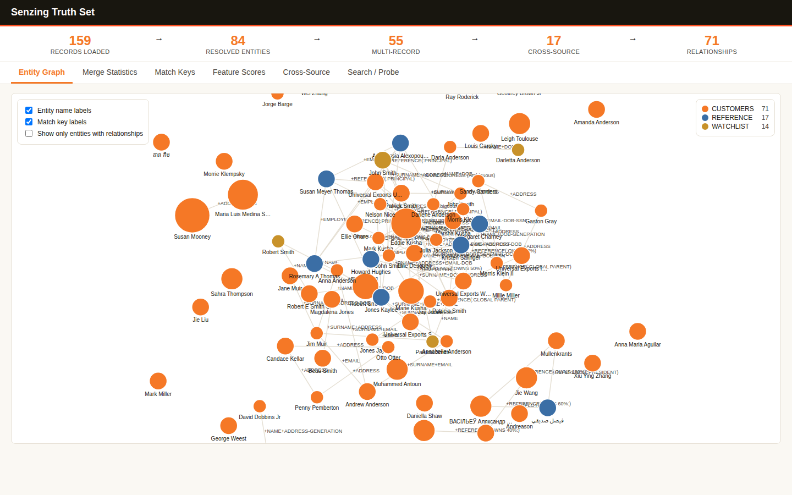

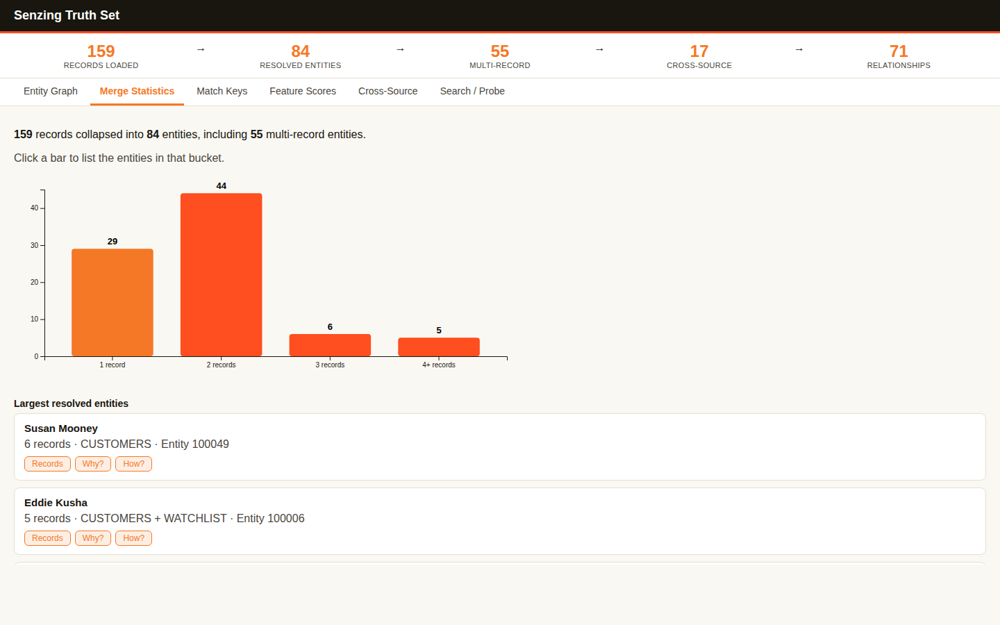

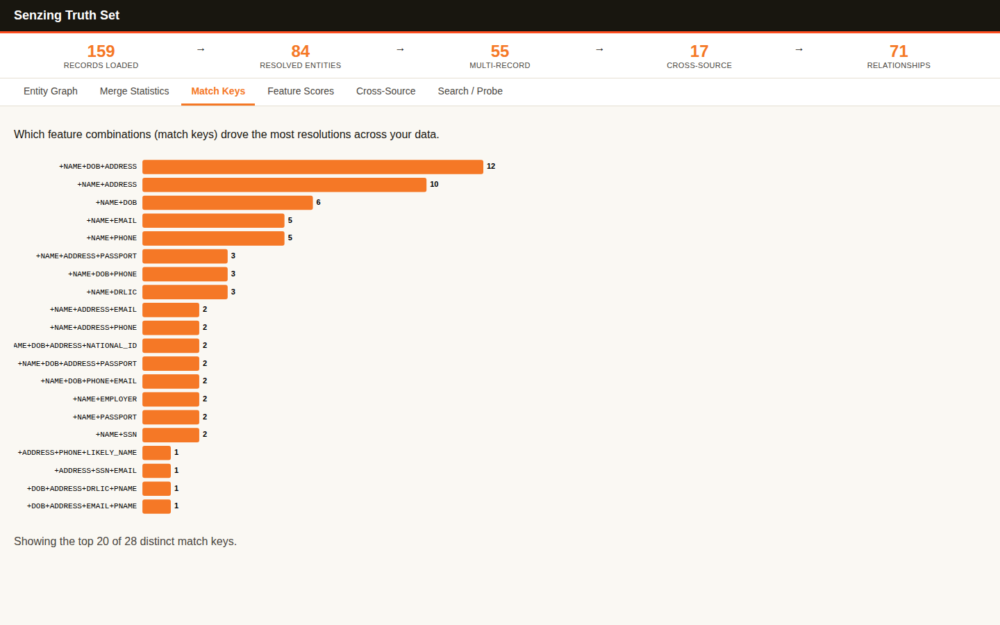

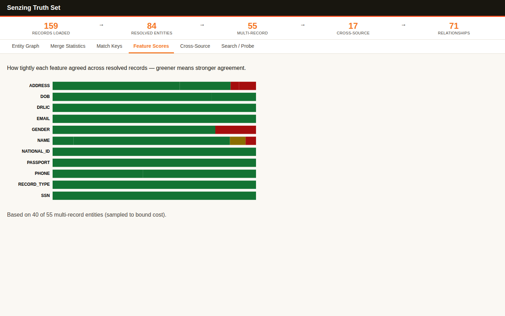

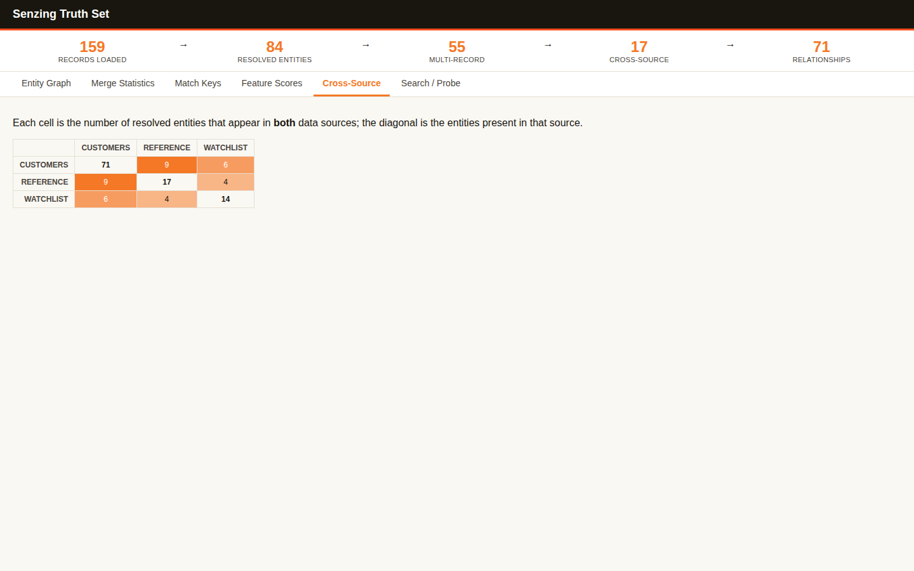

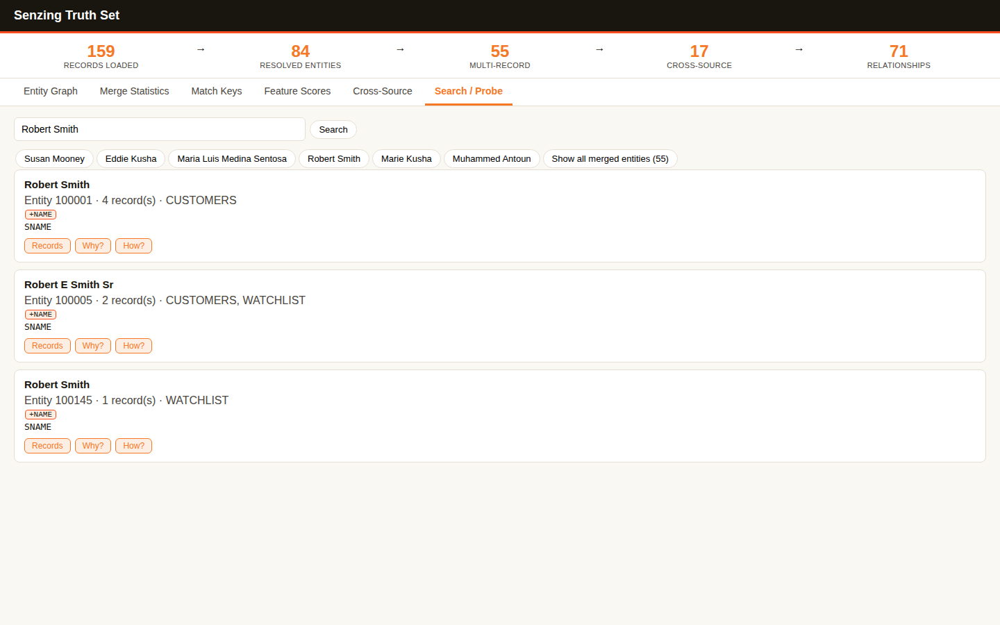

### End-of-Module Summary

**What you accomplished:**

- Watched the real Senzing Truth Set resolve in an interactive web app — 159 records collapsing into 84 entities, live on your own machine
- Explored the resolutions from six angles: the entity graph, merge statistics, match keys, feature scores, cross-source overlap, and search
- Saw the distinction that matters — three different Robert Smiths kept apart while their duplicates merged
- Kept a permanent offline copy of the whole app plus six verified screenshots

**Files produced:**

- `docs/visualizations/truthset_verification.html` — the standalone, fully offline snapshot of the app (411 KB)
- `docs/visualizations/truthset_verification-*.png` — six screenshots, one per tab
- `src/system_verification/truthset_data.jsonl` — the 159 Truth Set records
- `src/system_verification/register_truthset_sources.py` — registers the Truth Set data sources
- `src/system_verification/load_truthset.py` — loads the Truth Set
- `src/system_verification/cleanup_truthset.py` — purges the Truth Set records

**Why it matters:** This is the "wow moment" — concrete proof of what entity resolution does, on a dataset with known ground truth, before you point Senzing at your own messier data. The saved snapshot is yours to share with your team.

---

## Data collection — 2026-07-30T15:26:34Z

### Information Shared

- Random sampling from two sources destroys cross-source overlap: an initial 3,000-record preview batch from each of Enformion and Equifax shared only 15 distinct names out of ~2,800 — confirming the bootcamp's own warning about naive sampling.
- The built-in evaluation license caps ingestion at 500 records; after expanding to 5,000 total records, the collected total genuinely exceeded that limit, triggering the License Key gate.
- Senzing is locally hosted — no data flows to Senzing, Inc. — which is why the raw CORD files are still excluded from version control as a matter of general data-handling hygiene.

### Questions & Responses

- {initial pass: none — both sources already had `provenance: cord` recorded in Module 1, so the "how would you like to provide the data" question was correctly skipped per INV-006}
- **Q:** (Bootcamper request) I'd like to have 5000 records.
    - **R:** Reopened Data collection; expanded to 2,500 records per source (5,000 total).
- **Q:** Which best describes your Senzing License Key situation?
    - **R:** No — request a free evaluation license now through the bootcamp.
- **Q:** What's your first name (for the license request)?
    - **R:** Bootcamper.
- **Q:** What's your last name?
    - **R:** Example.
- **Q:** What's your work email address?
    - **R:** bootcamper@example.com.
- **Q:** How did you hear about Senzing?
    - **R:** Senzing bootcamp.
- **Q:** Send this evaluation-license request, including your name and work email, to Senzing?
    - **R:** Yes, send it.

### Actions Taken

- Initial pass: downloaded 3,000-record preview batches of Enformion and Equifax to compute cross-source name overlap (15 shared names found); built 250-record samples per source.
- On request, expanded scope: downloaded 10,000-record preview batches from each source (the download endpoint's apparent cap) and found 98 shared name-keys (115 Enformion records, 103 Equifax records).
- Rebuilt final samples at 2,500 records per source (5,000 total), keeping all 98 matched pairs whole and filling the remainder randomly (seed 42) for singletons and non-matches.
- Re-validated both files at the new scale: readable, non-empty, valid UTF-8 JSONL, expected record count, consistent `DATA_SOURCE`, `RECORD_ID` present on every record — both `passed`.
- Updated `config/data_sources.yaml` and `config/cord_metadata.yaml` (new SHA-256 hashes) to reflect the expanded samples.
- Ran the License Key gate: 5,000 records exceeds the 500-record evaluation limit, so submitted an in-flow evaluation-license request via the Senzing MCP server (`submit_feedback`, category `license_request`) after explicit bootcamper consent to send name and work email — continuing on the built-in evaluation license while the emailed key is pending.
- Created `.gitignore` excluding `data/raw/`, `database/`, and `licenses/` before any commit.
- Ran the SQLite load-time check: no MCP-confirmed timing threshold applies at this volume, so no warning was presented; Module 6 will use the threaded loading pattern automatically (record count > 500).

### End-of-Module Summary

**What you accomplished:**

- Collected real data for both sources in your Customer 360 scenario, expanded on request to 2,500 records each (5,000 total)
- Avoided a subtle, easy-to-miss failure: naive random sampling would have produced almost zero cross-source matches for Senzing to find — 98 real matched pairs were identified and preserved instead
- Requested a free Senzing evaluation license in-flow to cover the expanded volume, with explicit consent before any personal details were sent
- Confirmed both files are clean and ready for mapping, with a full audit trail of how and why they were sampled

**Files produced:**

- `data/raw/enformion.jsonl` — 2,500 Enformion records
- `data/raw/equifax.jsonl` — 2,500 Equifax records
- `docs/data_source_locations.md` — source locations and access methods
- `docs/data_collection_checklist.md` — inventory table and validation checklist
- `docs/security_compliance.md` — data privacy and handling notes
- `config/cord_metadata.yaml` — content-hash snapshot for change detection
- `.gitignore` — excludes raw data, the datastore, and licenses from version control

**Why it matters:** Data Quality, Mapping, and Transformation needs real, validated files to work with — and because these two sources actually overlap on 98 real people/organizations, the rest of the bootcamp will have genuine cross-source matches to find, not an empty result set.

---

## Data Quality, Mapping, and Transformation — 2026-07-30T15:41:16Z

### Information Shared

- The Entity Specification confirms two supported record shapes: the recommended `FEATURES` array and the still-supported legacy flat form ("In prior versions we allowed a flat JSON structure with a separate sub-list for each feature... While we still support that..."). Equifax uses both — `FEATURES` for persons, flat root attributes for organizations.
- `get_record_preview` asks Senzing how it actually reads a record without loading it, which is a stronger readiness test than reading attribute names against the specification by eye. It requires the record's `DATA_SOURCE` code to be registered first (`SENZ2207` otherwise) even though it writes nothing.
- Senzing derives usage type from attribute-name prefixes: `BUSINESS_ADDR_LINE1` becomes feature `ADDRESS` with `USAGE_TYPE: BUSINESS`, `FAX_PHONE_NUMBER` becomes `PHONE` with `USAGE_TYPE: FAX`.
- Completeness must be measured per record against the features applicable to that record's own `RECORD_TYPE`; averaging person-only features across an organization-heavy source penalizes data that could not exist.
- The quality score covers structural properties of one source in isolation. It says nothing about whether two sources resolve correctly against each other — that is established after loading, by the match-key audit in Data processing.

### Questions & Responses

- **Q:** Would you like to switch to Opus 5 in the model picker and high in the effort picker for this module?
    - **R:** Yes.
- **Q:** Are you done modifying the model and effort?
    - **R:** Yes.
- **Q:** Your CORD sources ENFORMION and EQUIFAX are already in Senzing-loadable form. Would you like to skip the mapping phase and proceed directly to loading?
    - **R:** Yes, skip.
- **Q:** Would you like a visual of the quality assessment?
    - **R:** Yes.

### Actions Taken

- Downloaded the Senzing Entity Specification to `docs/reference/senzing_entity_specification.md` (73 KB) and used it as the authoritative reference throughout.
- Profiled both sources' field structures, finding Enformion carries ~1,227 dynamic numeric root keys (the `REL_POINTER_KEY` repeated as a field name) atop ~23 stable fields.
- Registered `ENFORMION` and `EQUIFAX` data source codes (required before preview, and needed by loading anyway).
- Ran a readiness check on 200 records per source: structural check passed 200/200 for both, and `get_record_preview` confirmed Senzing extracts the intended features from every record.
- **Corrected an initial misreading:** Equifax's prefixed attribute names looked non-compliant against the specification, but the engine's own interpretation showed it derives usage types from the prefixes. Judging by eye would have sent good data through unnecessary remapping.
- Computed quality scores per record against each record's own `RECORD_TYPE`: ENFORMION 71.3%, EQUIFAX 75.3% — both in the "acceptable with gaps" band.
- Sanity-checked the 0% person-coverage figures against the raw records (0 of 1,394 Enformion persons carry any address attribute), confirming real data absence rather than a presence-test artifact.
- Found 8 Equifax records with a Las Vegas / 89xxx-ZIP address carrying a non-Nevada state code — format-valid but semantically wrong, and invisible to the format check.
- Fast-pathed both sources: `mapping_status: complete`, `fast_pathed: true`, `file_path` still pointing at the original `data/raw/` files.
- Wrote `docs/mapping/data_lineage.yaml` and verified all five fast-path invariants for both entries (source == output, records_in == records_out, zero rejected, null script, fast_pathed true).
- Generated and verified `docs/visualizations/data_quality_assessment.html` — brand tokens applied, zero external fetches, all data-sourced strings escaped, source colors assigned from the data present. Opened the rendered page to confirm the bars drew and the band labels match the computed scores.

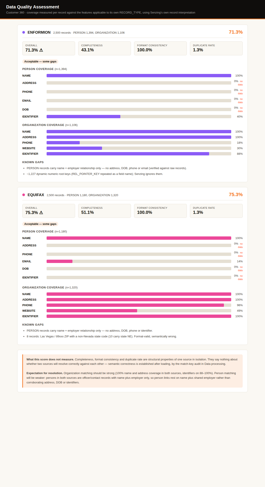

### End-of-Module Summary

**What you accomplished:**

- Verified both sources are genuinely Senzing-loadable using the engine's own record interpretation, not a by-eye reading of field names
- Scored data quality correctly per record type, avoiding the averaging error that would have flagged clean organization data as needing remediation
- Skipped mapping entirely for both sources, with a full lineage record proving no transformation occurred
- Learned what the resolution will and won't be able to do: strong organization matching, weaker name-plus-employer person matching

**Files produced:**

- `docs/reference/senzing_entity_specification.md` — the authoritative Entity Specification
- `docs/data_source_evaluation.md` — the evaluation report for both sources
- `docs/mapping/data_lineage.yaml` — fast-path lineage entries, invariants verified
- `docs/visualizations/data_quality_assessment.html` — offline, brand-styled quality visual
- `docs/visualizations/data_quality_assessment.png` — rendered screenshot
- `src/scripts/register_project_sources.py` — registers ENFORMION and EQUIFAX
- `src/scripts/preview_records.py` — asks Senzing how it reads a record
- `src/scripts/readiness_check.py` — structural + preview-based readiness check
- `src/scripts/quality_assessment.py` — per-record-type quality scorer
- `src/scripts/generate_quality_viz.py` — the visualization generator

**Why it matters:** Both sources go into loading unmodified, which means anything the resolution gets wrong is a real property of the data rather than something a mapping step introduced — and you now know in advance which matches to expect and which to be skeptical of.

---

## Data processing — 2026-07-30T15:55:28Z

### Information Shared

- The loader's architecture follows the *production* volume target, not the bootcamp dataset: `sdk_guide` switches template at a 500-record cutover, and a medium-tier target selects the threaded pattern while labelling the single-threaded one "demo-only".
- Sorted or grouped input costs 2-10x throughput through lock contention, rated `error` severity by Senzing's own anti-pattern list. This project's files were grouped (matched pairs written first during collection), so shuffling before load genuinely mattered.
- Redo must be drained by looping on `get_redo_record()` returning empty. Using `count_redo_records()` as the loop sentinel is a documented anti-pattern: it table-scans per call, and because redo generates more redo, a count-driven loop is O(n squared).
- In a match key, `+` means the feature contributed and `-` means it detracted. A feature detracting on many cross-source comparisons can mean two source fields measuring different things were mapped to the same feature, silently suppressing legitimate merges.
- The Entity Specification's `TRUSTED_ID` rule: same `TRUSTED_ID_TYPE` with a different number forces records apart, but different types "do not interact at all" — the type namespaces the comparison.
- Whether an export carries `RELATED_ENTITIES` depends on the flag set, not the method, so one row must be dumped and its top-level keys read before writing any parser.

### Questions & Responses

- **Q:** In production — not in this bootcamp — how many records do you expect to load?
    - **R:** Option 3 — medium production (>500,000 up to 10,000,000).
- **Q:** Loading this data volume into SQLite may slow entity resolution as the database grows. How would you like to proceed?
    - **R:** Proceed on SQLite.

### Actions Taken

- Verified CORD data freshness by SHA-256 against the Module 4 snapshot (both sources unchanged) and backed up the database to `data/backups/G2C.db.pre-load`.
- Built `src/load/load_senzing.py` from the MCP threaded pattern, adding input shuffling, per-record error logging, throughput reporting, checkpoint/resume, and one shared factory.
- Built `src/load/process_redo.py` as a drain variant of the MCP continuous-daemon pattern, with the count used for monitoring only.
- Test-loaded 50 records, then loaded 2,500 Enformion (2.4s) and 2,500 Equifax (4.3s) — 5,000 total, **zero errors**.
- Drained the redo queue: backlog 443 to 0, processing 452 records (more than the backlog, because redo cascades).
- **Measured the active license rather than assuming it:** `recordLimit: 0` (no cap), Senzing Internal EVAL expiring 2027-03-12. This corrected the generic 500-record figure relayed in earlier modules, which never applied to this machine.
- Dumped one export row before parsing; confirmed `RELATED_ENTITIES` present with populated `MATCH_KEY`, and confirmed `SZ_EXPORT_ALL_FLAGS` is absent from the Python binding.
- Ran the ER statistics and match-key audit in a single export pass with relationships deduplicated by `(min_id, max_id)`.
- **Investigated the `-TRUSTED_ID` suppressor with concrete evidence** (88.5% single-source, 11.3% cross-source) and cleared it: zero cross-source single-source-pair relationships carry it; all are same-type force-apart between different businesses sharing an address. Entity 200021 proved the namespacing works, holding both a `BID` and an `EFX_ID` after merging across sources.
- Verified 3 cross-source merges against raw source records (all true positives) and inspected the largest entity (400304, `MIKE FIGLEY`, 3 records) for over-matching — correct.
- Analyzed the under-matching side: 128 cross-source `POSSIBLY_SAME` pairs, 122 on `+NAME` alone, with evidence showing name is the only shared feature on those person pairs.

### End-of-Module Summary

**What you accomplished:**

- Loaded all 5,000 records across two sources with zero errors and drained the redo queue
- Built a take-home loader whose architecture matches your stated production volume, with every documented loading anti-pattern deliberately avoided
- Ran a match-key audit that caught a suspicious 88.5% suppressor and, with evidence, proved it was the engine working correctly rather than a mapping defect
- Validated the results against actual records instead of aggregate statistics: 3/3 merges true positives, zero false merges

**Files produced:**

- `src/load/load_senzing.py` — threaded production loader with shuffling, error logging, throughput reporting, checkpoint/resume
- `src/load/process_redo.py` — redo drain with monitoring-only counts
- `src/load/register_data_sources.py` — idempotent data-source registration
- `src/scripts/er_statistics.py` — single-pass ER statistics and match-key audit
- `src/scripts/probe_export_row.py`, `probe_suppressor.py`, `probe_undermatching.py`, `probe_entity.py` — evidence probes
- `src/scripts/check_license.py` — measures the active license
- `docs/er_statistics.json`, `docs/results_validation.md`, `docs/uat_results.md`, `docs/loading_strategy.md`, `docs/stakeholder_summary_module6.md`
- `config/license.json` — the measured license record

**Why it matters:** The data is resolved and the results are trustworthy for a specific reason: the one signal that looked like a defect was chased down with evidence rather than accepted or dismissed, and the limits on person matching are understood as a property of the source data rather than a mystery.

---

## Query, Visualize and Discover — 2026-07-30T16:18:05Z

### Information Shared

- Reading match keys in your own data's terms: `+` means the feature contributed, `-` means it detracted, and the difference between `+NAME` alone (queued for review) and `+NAME+ADDRESS` (resolved) is the whole gap between 20 merges and 128 review items.
- Flag defaults differ per method and this bites silently: `SZ_ENTITY_DEFAULT_FLAGS` (get_entity) carries both `RECORDS[]` and `RECORD_SUMMARY[]`, but `SZ_SEARCH_BY_ATTRIBUTES_ALL` carries only the summary — so a habit learned on get_entity yields an empty records list on search, with a correct field name and no error.
- `NAME_ORG` is the organization name attribute; an organization name sent as `NAME_FULL` matches nothing and raises nothing. Roughly half this data is organizations, so the search tries both.
- Precision and recall require a truth set. Without one, only proxy indicators are available — entity size distribution, cross-source rates, singleton rate, and manual sampling.
- Why vs. How: Why explains the current decision between two records or entities; How shows one entity's chronological construction history. "Why are these two people in the same room?" versus "watch the security footage of everyone entering."
- Python's graph methods take native collections (`entity_ids: List[int]`), not the `{"ENTITIES":[...]}` document the Java/C# signatures imply — and network link endpoints are `MIN_ENTITY_ID`/`MAX_ENTITY_ID`, not `ENTITY_ID`/`RELATED_ENTITY_ID`.

### Questions & Responses

- **Q:** Is there anything you'd like to adjust? (about the derived query requirements)
    - **R:** No.
- **Q:** The quality indicators are marginal on their raw values. What would you like to do?
    - **R:** Proceed to visualization and the Discover phase.
- **Q:** Would you like an interactive visualization of your resolved data?
    - **R:** Yes.
- **Q:** Would you like to explore Senzing's advanced discover capabilities using examples from your own data?
    - **R:** Yes.
- **Q:** What would you like to do next? (after Why Analysis)
    - **R:** Continue to How Analysis.
- **Q:** What would you like to do next? (after How Analysis)
    - **R:** Continue to Relationship Networks (exploring how entities connect to each other).
- **Q:** Would you like to continue to module completion now?
    - **R:** Yes.

### Actions Taken

- Derived five query requirements from the business problem's success criteria and desired output, and built a program for each in `src/query/`.
- Ran all five: 20 cross-source merges found, entity 360 with source provenance confirmed, a 128-pair review queue built, search verified on both an organization and a person, and a 4,971-entity master list exported to CSV and JSONL.
- Evaluated quality using proxy indicators (no truth set available), reported the marginal 8.2% possible-match rate honestly, and explained why iteration would not help — showing three specific entities as evidence rather than asserting it.
- Built the interactive visualization pointed at the bootcamper's own data, with dataset wording naming their sources rather than the Truth Set, and verified the snapshot offline with all six tabs.
- Captured and visually verified one screenshot per tab; confirmed the graph's scale-aware defaults engaged correctly at 4,971 entities (labels auto-hidden, relationship-only mode on, with an on-screen explanation).
- Ran the full Discover phase: identified candidates from 5,000 folded record keys, then demonstrated Why Analysis (entity 200048), How Analysis (entity 400304), and relationship networks with a 2-hop `find_path`.
- Dumped a raw `find_network` link element before writing the parser, which caught the `MIN_ENTITY_ID`/`MAX_ENTITY_ID` naming — under the assumed names both endpoints would have rendered blank while the match key rendered fine.
- **Found the ATLAS FOODS ambiguity:** four distinct Enformion entities sharing one name, one address, and one encrypted tax ID, unable to merge because their differing `BID` values map to the exclusive `TRUSTED_ID` feature — and therefore all four flagged ambiguous against the single Equifax record.
- Produced and verified the data-discoveries deliverable, extracting PDF text to confirm the findings are present rather than trusting the generator's success line.

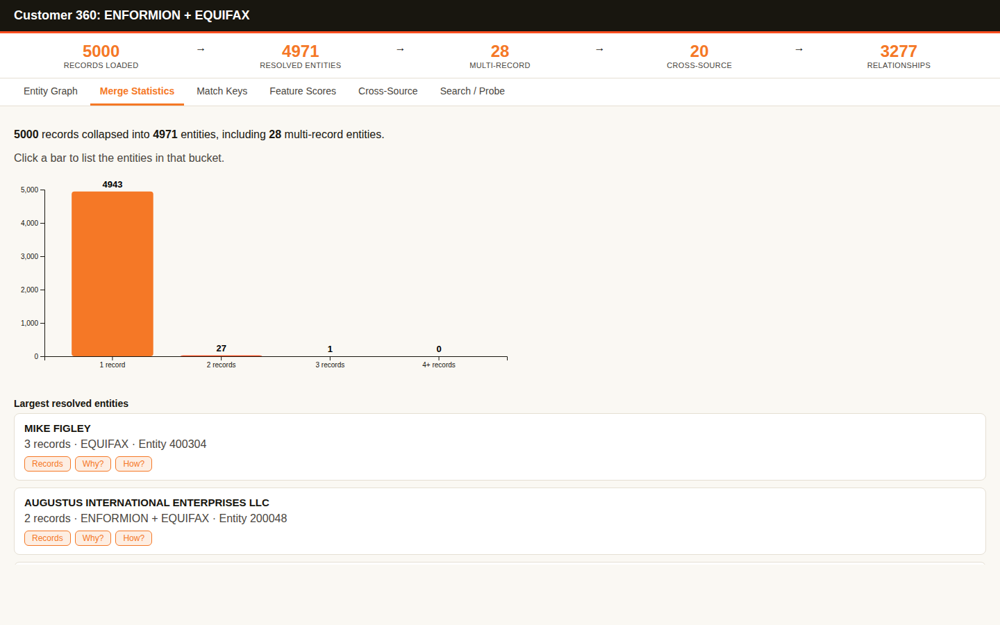

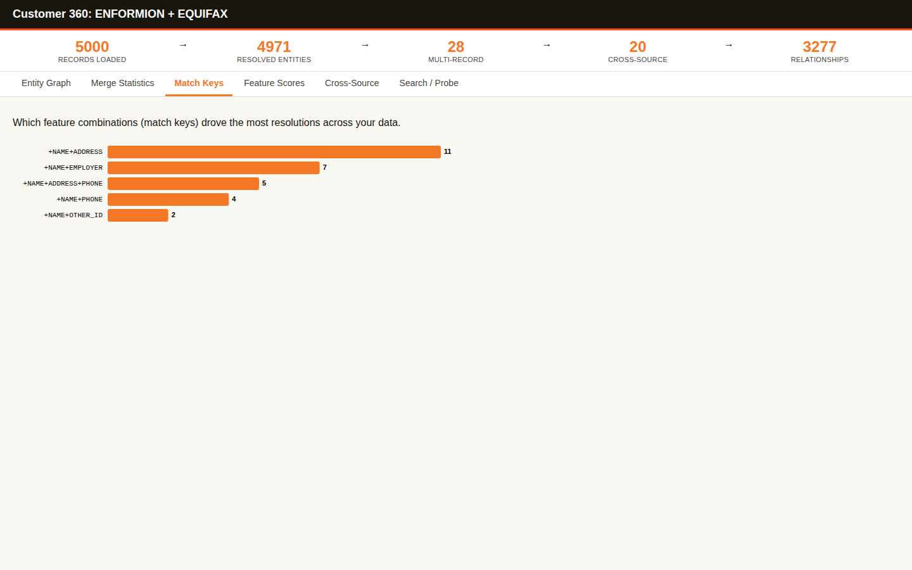

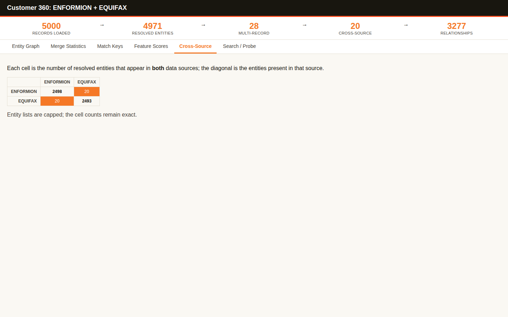

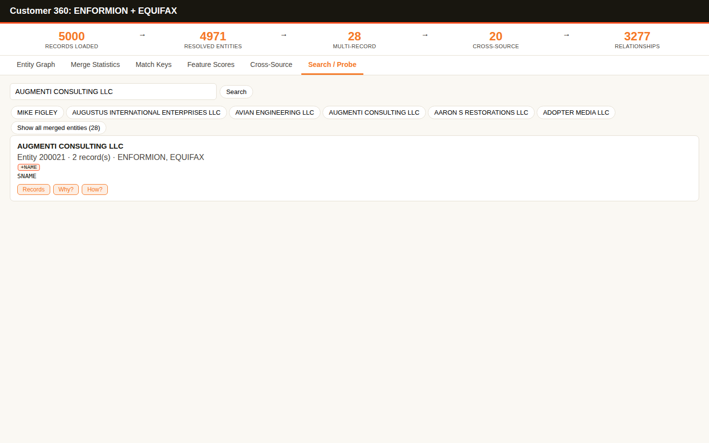

### End-of-Module Summary

**What you accomplished:**

- Built and ran five query programs that answer your business problem's success criteria directly
- Explored your own resolved data in the interactive app, and saw its defaults adapt to a dataset 60 times larger than the Truth Set
- Learned Why, How, and relationship networks on your own entities — including a 2-hop connection that exists in no single record
- Uncovered a genuine, actionable mapping question (the ATLAS FOODS ambiguity) that no aggregate statistic would have surfaced
- Left with a discoveries report whose every figure is traceable to a query you can re-run

**Files produced:**

- `docs/bootcamp_data_discoveries.md` and `.pdf` — the findings report, PDF verified by text extraction
- `docs/visualizations/results_visualization.html` — the offline interactive app pointed at your data
- `docs/visualizations/results_visualization-*.png` — six screenshots, one per tab
- `docs/master_list.csv` and `.jsonl` — the 4,971-entity master list
- `docs/er_statistics.json`, `docs/discover_candidates.json` — the underlying measurements
- `src/query/` — eleven programs: `sz_common.py`, `find_cross_source_merges.py`, `customer_360.py`, `review_queue.py`, `search_entities.py`, `export_master_list.py`, `discover_candidates.py`, `why_analysis.py`, `why_entities.py`, `how_analysis.py`, `relationship_network.py`, `probe_network_shape.py`

**Why it matters:** You can now answer "who is who across these two systems?" with evidence for every claim — and just as importantly, explain precisely why 128 pairs *cannot* be answered yet, which is the difference between a result you can act on and a number you have to trust.

---
